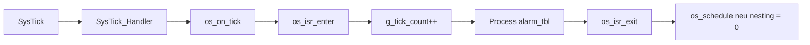

# Bài 05 - SysTick Time Base và Tick Safety (Project Os_Test)

## Mục tiêu
- Hiểu cách `Os_Test` tạo time base 1 ms bằng `SysTick`.
- Hiểu vai trò của `g_tick_count`, `alarm_tbl[]` và `g_interrupt_nesting`.
- Hiểu vì sao scheduler chỉ được xét sau khi thoát ISR ngoài cùng.

## Source cần đọc
- `Config/os_config.h`
- `OS/inc/os_kernel.h`
- `OS/src/os_port.c`
- `OS/src/os_port_asm.s`
- `OS/src/os_kernel.c`

## Lý thuyết chuyên sâu
- `os_port_start_systick()` tính reload bằng công thức:
  - `(SystemCoreClock / OS_TICK_HZ) - 1`
- `SysTick_Handler` trong assembly chỉ làm một việc:
  - gọi `os_on_tick()`
- `os_on_tick()` là ISR service của kernel:
  - `os_isr_enter()` tăng `g_interrupt_nesting`
  - tăng `g_tick_count`
  - quét `alarm_tbl[]`
  - alarm hết hạn thì `ActivateTask()`
  - `os_isr_exit()` giảm nesting và chỉ gọi `os_schedule()` khi đã ra khỏi ISR ngoài cùng
- Đây là điểm quan trọng của `tick safety`:
  - phần cứng tạo tick đúng chu kỳ
  - kernel không dispatch ngay trong lúc còn ISR nesting
  - dữ liệu dùng chung được bảo vệ qua `PRIMASK save/restore`



## Code minh họa
```c
void os_on_tick(void)
{
    os_isr_enter();
    g_tick_count++;

    for (uint8_t i = 0u; i < OS_MAX_ALARMS; ++i) {
        OsAlarm_t *alarm = &alarm_tbl[i];
        if (!alarm->active) {
            continue;
        }
        if (alarm->remain_ms > 0u) {
            alarm->remain_ms--;
        }
        if (alarm->remain_ms == 0u) {
            ActivateTask(alarm->target_task);
        }
    }

    os_isr_exit();
}
```

## Lab và checklist
- Tự tính reload cho `72 MHz` và `1 kHz`.
- Breakpoint tại:
  - `os_port_start_systick()`
  - `SysTick_Handler`
  - `os_on_tick()`
  - `os_schedule()`
- Trả lời:
  - Vì sao `__disable_irq()` kiểu "mở lại đúng trạng thái cũ" an toàn hơn cặp gọi thẳng `__disable_irq()` / `__enable_irq()` trong kernel?
  - Vì sao `g_interrupt_nesting` giúp tránh context switch giữa chừng khi còn ISR lồng nhau?
