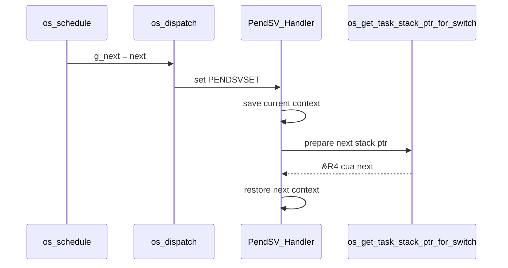

# Bài 06 - SVC, PendSV, Context Switch và Scheduler Loop (Project Os_Test)

## Mục tiêu
- Đọc được `SVC_Handler`, `PendSV_Handler` và `os_dispatch()`.
- Hiểu handoff giữa scheduler viết bằng C và phần switch viết bằng assembly.
- Hiểu vai trò của `os_get_task_stack_ptr_for_switch()`.

## Source cần đọc
- `OS/src/os_port_asm.s`
- `OS/src/os_kernel.c`
- `OS/src/os_port.c`

## Lý thuyết chuyên sâu
- `OS_Start()` phát `svc 0` để bootstrap task đầu tiên.
- `SVC_Handler` không tự dựng stack bằng tay nữa.
  - handler lấy `g_current`
  - gọi `os_get_task_stack_ptr_for_switch()`
  - helper này sẽ init stack nếu `context_needs_init = 1`
  - sau đó assembly chỉ restore `R4-R11`, set `PSP` và exception return
- `PendSV_Handler` làm context switch thật:
  - kiểm tra `g_next`
  - save `R4-R11` của task hiện tại vào PSP hiện tại
  - cập nhật `current->sp`
  - `g_current = g_next`, `g_next = NULL`
  - gọi `os_get_task_stack_ptr_for_switch(next)`
  - restore `R4-R11` của task mới
  - `BX lr` để exception return
- `os_schedule()` làm phần policy:
  - current không `RUNNING` thì lấy ready task ưu tiên cao nhất
  - current đang `RUNNING` thì chỉ preempt khi có task ready priority cao hơn
  - nếu cần switch thì set `g_next` rồi `os_dispatch()`
- `os_dispatch()` chỉ trigger `PendSV`.
  - business logic nằm ở C
  - phần save/restore nằm ở assembly



## Code minh họa
```c
void os_dispatch(void)
{
    if (g_next == NULL) {
        return;
    }
    os_trigger_pendsv();
}
```

## Lab và checklist
- Breakpoint tại:
  - `OS_Start()`
  - `SVC_Handler`
  - `os_schedule()`
  - `PendSV_Handler`
  - `os_get_task_stack_ptr_for_switch()`
- Trả lời:
  - Vì sao `context_needs_init` giúp xử lý đúng trường hợp task terminate rồi được activate lại?
  - Vì sao `PendSV_Handler` không nên tự quyết định chọn task nào?
