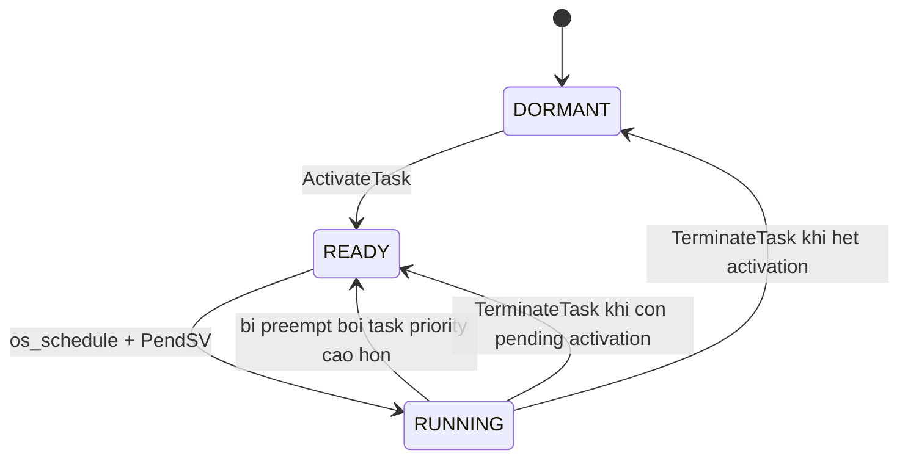

# Bài 07 - TCB, Khởi Tạo Stack và Task States (Project Os_Test)

## Mục tiêu
- Đọc được `TCB_t` mới của `Os_Test`.
- Phân loại field tĩnh và field động.
- Hiểu vì sao `context_needs_init` và `activation_count` là 2 field runtime khác nhau.

## Source cần đọc
- `OS/inc/os_kernel.h`
- `OS/src/os_kernel.c`
- `OS/src/os_port.c`
- `Config/os_config.h`

## Lý thuyết chuyên sâu
- `TCB_t` hiện có cả cấu hình tĩnh lẫn trạng thái động.
- Các field tĩnh:
  - `stack_base`
  - `stack_words`
  - `entry`
  - `arg`
  - `id`
  - `base_priority`
  - `max_activations`
- Các field động:
  - `sp`
  - `current_priority`
  - `activation_count`
  - `context_needs_init`
  - `state`
- `sp` vẫn phải là field đầu tiên vì assembly save/restore context truy cập offset 0.
- `os_get_task_stack_ptr_for_switch()` và `os_task_stack_init()` phối hợp để dựng stack frame giả giống lúc CPU quay ra khỏi exception.
- State machine hiện tại:
  - `OS_DORMANT`
  - `OS_READY`
  - `OS_RUNNING`
  - `OS_WAITING` đã có trong enum để mở rộng về sau, nhưng chưa dùng trong bài 05-08



## Code minh họa
```c
typedef struct TCB {
    uint32_t         *sp;
    uint32_t         *stack_base;
    uint32_t          stack_words;
    void            (*entry)(void *arg);
    void             *arg;
    uint8_t           id;
    uint8_t           base_priority;
    uint8_t           current_priority;
    uint8_t           max_activations;
    volatile uint8_t  activation_count;
    volatile uint8_t  context_needs_init;
    volatile uint8_t  state;
} TCB_t;
```

## Lab và checklist
- Chọn `TASK_A` hoặc `TASK_B` và đánh dấu field tĩnh/động.
- Theo dõi `activation_count` và `context_needs_init` trước, trong và sau `TerminateTask()`.
- Trả lời:
  - Vì sao `activation_count > 0` không đồng nghĩa task đang `READY`?
  - Vì sao task có thể bị save context vào `sp` nhưng lần chạy sau vẫn phải init lại từ đầu?
