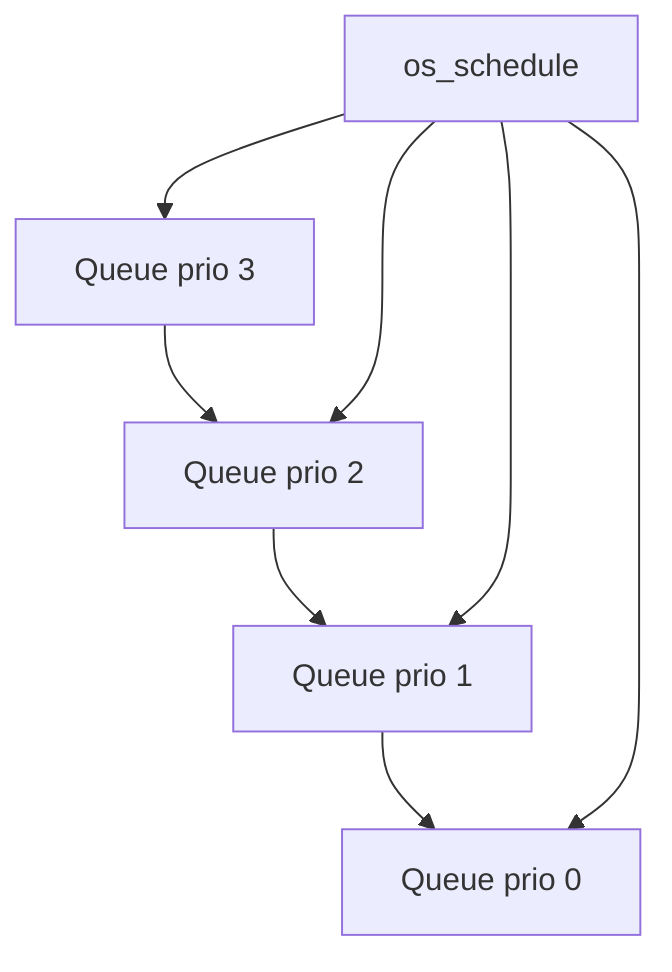

# Bài 08 - Ready Queue và Priority Dispatch Deterministic (Project Os_Test)

## Mục tiêu
- Hiểu ready queue hiện tại của `Os_Test`.
- Hiểu FIFO trong cùng priority.
- Hiểu vì sao dispatch hiện tại là deterministic.

## Source cần đọc
- `OS/src/os_kernel.c`
- `Config/os_config.h`

## Lý thuyết chuyên sâu
- `Os_Test` hiện dùng:
  - một ring buffer cho mỗi priority
  - một mảng `task_queued[]` để tránh enqueue trùng
- Luật chọn task:
  - quét từ `OS_MAX_PRIORITY` xuống `0`
  - trong cùng priority thì FIFO
- `os_ready_add_front()` được dùng khi task đang chạy bị preempt bởi task priority cao hơn.
  - task đang chạy được đưa lại vào đầu queue của chính priority của nó
  - cách này giữ được thứ tự deterministic cho round tiếp theo
- `os_schedule()` hiện có hai nhánh chính:
  - current không còn `RUNNING`: pop highest ready và switch
  - current vẫn `RUNNING`: chỉ preempt nếu peek task có `current_priority` cao hơn



## Code minh họa
```c
static uint8_t os_ready_pop_highest(void)
{
    for (int prio = (int)OS_MAX_PRIORITY; prio >= 0; --prio) {
        OsReadyQueuePrio_t *q = &ready_queues[prio];
        if (q->count > 0u) {
            uint8_t tid = q->buf[q->head];
            q->head = (uint8_t)((q->head + 1u) % OS_MAX_TASKS);
            q->count--;
            task_queued[tid] = false;
            return tid;
        }
    }
    return OS_INVALID_TASK_ID;
}
```

## Lab và checklist
- In `head`, `tail`, `count` của từng queue priority.
- Kịch bản gợi ý:
  - để `TASK_IDLE` đang chạy
  - kích hoạt `TASK_B`
  - sau đó kích hoạt `TASK_A`
  - quan sát `TASK_A` preempt `TASK_B` hay không dựa trên priority cấu hình
- Trả lời:
  - Vì sao cần `task_queued[]` thay vì chỉ dựa vào `state`?
  - Khi nào dùng enqueue tail, khi nào dùng enqueue head?
