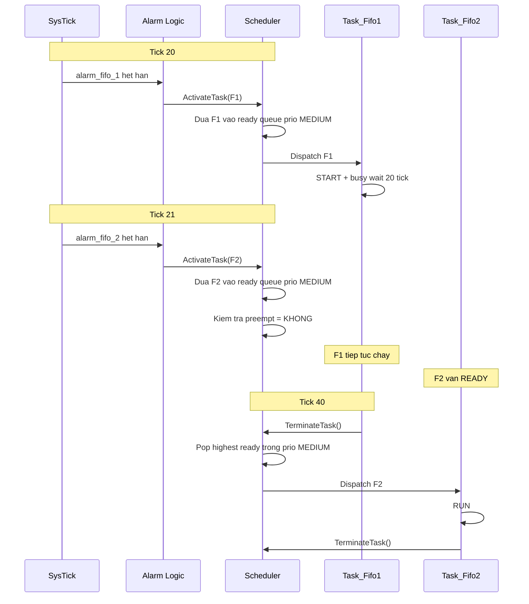

# Bài 09 - Priority FIFO: Luồng Test Chi Tiết, Cách Chạy Tay và Phân Tích Scheduler

## Mục tiêu
- Hiểu chính xác tôi đã test gì cho chế độ `priority_fifo`.
- Tự chạy lại được scenario này bằng tay trên chính project `Os_Test`.
- Dạy lại được cho học viên theo kiểu "thấy tận mắt luồng chạy", không chỉ nói lý thuyết.
- Đi sâu vào bản chất của:
  - `alarm` kích hoạt task
  - `ready queue` theo priority
  - `FIFO` trong cùng priority
  - vì sao task thứ hai không được chạy ngay
  - vì sao scheduler chỉ đổi task ở đúng `dispatch point`

---

## 1. Ý tưởng của scenario `priority_fifo`

Scenario này không nhằm chứng minh "task priority cao hơn sẽ chạy trước" theo kiểu preemptive.

Scenario này nhằm chứng minh một ý rất cụ thể:

**Nếu hai task cùng priority được kích hoạt lệch nhau, thì task đến trước sẽ chạy trước, task đến sau phải đợi theo FIFO.**

Trong project hiện tại, tôi dùng:
- `Task_Fifo1`
- `Task_Fifo2`

Hai task này:
- có cùng priority `OS_PRIO_MEDIUM`
- đều là one-shot
- được kích bởi hai alarm one-shot khác nhau
- `Task_Fifo1` chạy đủ lâu để `Task_Fifo2` được activate trong lúc `Task_Fifo1` vẫn đang `RUNNING`

Chính điểm đó làm lộ rõ bản chất FIFO.

---

## 2. Các file cần đọc khi dạy bài này

- `Config/os_config.h`
- `Config/os_app_cfg.h`
- `Config/os_app_cfg.c`
- `app/App_Task.c`
- `OS/src/os_kernel.c`
- `OS/src/os_port_asm.s`
- `test_os.py`

Nếu chỉ dạy logic scheduling, trọng tâm là:
- `Config/os_app_cfg.c`
- `app/App_Task.c`
- `OS/src/os_kernel.c`
- `test_os.py`

---

## 3. Cấu hình build đúng của scenario này

### 3.1. Build define được test

Trong test automation, scenario `priority_fifo` build firmware bằng:

```sh
make clean
make -j4 all EXTRA_DEFINES='-DOS_ACTIVE_APP_PROFILE=1 -DOS_SCHED_MODE_DEFAULT=0'
```

Ý nghĩa:
- `OS_ACTIVE_APP_PROFILE=1` tương ứng `OS_APP_PROFILE_VALUE_PRIORITY_FIFO`
- `OS_SCHED_MODE_DEFAULT=0` tương ứng `OS_SCHEDMODE_PRIORITY_FIFO`

Các giá trị số này được định nghĩa trong `Config/os_config.h`.

### 3.2. Macro profile/mode

Trong `Config/os_config.h`:

```c
#define OS_APP_PROFILE_VALUE_DEMO             0u
#define OS_APP_PROFILE_VALUE_PRIORITY_FIFO    1u
#define OS_APP_PROFILE_VALUE_FULL_PREEMPTIVE  2u
#define OS_APP_PROFILE_VALUE_NON_PREEMPTIVE   3u
#define OS_APP_PROFILE_VALUE_MIXED            4u
#define OS_APP_PROFILE_VALUE_SCHEDULE_TABLE   5u
```

và:

```c
#define OS_PRIO_IDLE      0u
#define OS_PRIO_LOW       1u
#define OS_PRIO_MEDIUM    2u
#define OS_PRIO_HIGH      3u
#define OS_PRIO_CRITICAL  4u
```

Ý nghĩa với bài này:
- `Task_Fifo1` và `Task_Fifo2` cùng nằm ở mức `OS_PRIO_MEDIUM = 2`
- scheduler mode là `PRIORITY_FIFO`

---

## 4. Task nào tham gia trong scenario này

Trong `Config/os_app_cfg.c`, cấu hình task chung cho mọi profile có:

```c
[TASK_FIFO_1] = {
    .id = TASK_FIFO_1,
    .name = "Task_Fifo1",
    .entry = Task_Fifo1,
    .stack_words = 160u,
    .base_priority = OS_PRIO_MEDIUM,
    .max_activations = 1u,
    .autostart = 0u,
    .sched_class = OS_TASK_SCHED_PREEMPTIVE
},
[TASK_FIFO_2] = {
    .id = TASK_FIFO_2,
    .name = "Task_Fifo2",
    .entry = Task_Fifo2,
    .stack_words = 160u,
    .base_priority = OS_PRIO_MEDIUM,
    .max_activations = 1u,
    .autostart = 0u,
    .sched_class = OS_TASK_SCHED_PREEMPTIVE
},
```

Điểm quan trọng:
- cùng priority
- đều không autostart
- chỉ được bật lên bởi alarm

Ngoài ra còn có:
- `Task_Init`: autostart
- `Task_Idle`: autostart/fallback

Nên luồng ban đầu luôn là:
1. `Task_Init`
2. `Task_Idle`
3. chờ alarm kích `Task_Fifo1`

---

## 5. Alarm nào được bật trong profile `priority_fifo`

Trong `Config/os_app_cfg.c`, riêng nhánh:

```c
#elif (OS_ACTIVE_APP_PROFILE == OS_APP_PROFILE_VALUE_PRIORITY_FIFO)
```

ta có:

```c
[ALARM_FIFO_1] = {
    .id = ALARM_FIFO_1,
    .name = "Alarm_Fifo1",
    .autostart = 1u,
    .delay_ms = 20u,
    .cycle_ms = 0u,
    .target_task = TASK_FIFO_1
},
[ALARM_FIFO_2] = {
    .id = ALARM_FIFO_2,
    .name = "Alarm_Fifo2",
    .autostart = 1u,
    .delay_ms = 21u,
    .cycle_ms = 0u,
    .target_task = TASK_FIFO_2
},
```

Ý nghĩa:
- `Task_Fifo1` được kích ở tick `20`
- `Task_Fifo2` được kích ở tick `21`
- cả hai chỉ kích **một lần**

Khoảng cách `20 ms` và `21 ms` là cố ý:
- `Task_Fifo1` bắt đầu chạy trước
- chỉ sau `1 tick`, `Task_Fifo2` được kích
- lúc đó `Task_Fifo1` vẫn đang chạy

Đây là tình huống đẹp nhất để quan sát FIFO.

---

## 6. Task body thực sự làm gì

Trong `app/App_Task.c`:

```c
void Task_Fifo1(void *arg)
{
    (void)arg;

    app_log_line("[FIFO] Task_Fifo1 START");
    app_busy_wait_ticks(20u);
    app_log_line("[FIFO] Task_Fifo1 END");
    TerminateTask();
}

void Task_Fifo2(void *arg)
{
    (void)arg;

    app_log_line("[FIFO] Task_Fifo2 RUN");
    TerminateTask();
}
```

Ý nghĩa:
- `Task_Fifo1` cố tình giữ CPU khoảng `20 tick`
- `Task_Fifo2` rất ngắn, chỉ log rồi kết thúc

Điểm sư phạm quan trọng:
- nếu `Task_Fifo1` quá ngắn, nó có thể kết thúc trước khi `Task_Fifo2` được kích
- khi đó bạn sẽ không dạy được bản chất "đến sau nhưng không chen ngang"

---

## 7. Bản chất ready queue trong kernel

Trong `OS/src/os_kernel.c`:

### 7.1. Queue theo từng priority

Mỗi priority có một ring buffer riêng:

```c
typedef struct {
    uint8_t buf[OS_MAX_TASKS];
    uint8_t head;
    uint8_t tail;
    uint8_t count;
} OsReadyQueuePrio_t;
```

### 7.2. Thêm task vào cuối queue

```c
static inline void os_ready_enqueue_tail(uint8_t prio, uint8_t tid)
```

và:

```c
static inline void os_ready_add(uint8_t tid, uint8_t prio)
```

đều đưa task mới vào **đuôi queue**.

Đó chính là nguồn gốc của FIFO:
- task đến trước nằm gần `head`
- task đến sau nằm ở `tail`
- lúc lấy ra, kernel pop từ `head`

### 7.3. Scheduler chọn task như thế nào

Kernel quét từ priority cao xuống thấp:

```c
static uint8_t os_ready_pop_highest(void)
```

Nghĩa là:
1. chọn priority cao nhất còn task READY
2. trong priority đó, lấy task ở đầu queue

Với hai task cùng priority:
- không có sự khác biệt về độ ưu tiên
- yếu tố quyết định duy nhất là **thứ tự vào queue**

Đó là FIFO thuần túy.

---

## 8. Vì sao `priority_fifo` trong project này không preempt task đang chạy

Mấu chốt nằm ở:

```c
static bool os_should_preempt(const TCB_t *current, const TCB_t *candidate)
```

Trong `OS/src/os_kernel.c`:

```c
switch (g_scheduler_mode)
{
    case OS_SCHEDMODE_PRIORITY_FIFO:
    case OS_SCHEDMODE_NON_PREEMPTIVE:
        return false;

    case OS_SCHEDMODE_FULL_PREEMPTIVE:
        return true;

    case OS_SCHEDMODE_MIXED:
        return (current->sched_class == (uint8_t)OS_TASK_SCHED_PREEMPTIVE);
}
```

Ý nghĩa:
- trong mode `PRIORITY_FIFO`, khi current task đang `RUNNING`, scheduler **không được phép** cưỡng bức cắt ngang current để chạy candidate
- task mới READY chỉ xếp hàng chờ

Đây là điểm cực kỳ quan trọng khi dạy:

**Trong project hiện tại, `priority_fifo` là "priority-based selection at dispatch points", không phải "full preemptive priority scheduling".**

Nói cách khác:
- priority vẫn quyết định thứ tự lấy task khi cần chọn task mới
- nhưng không có quyền chiếm CPU giữa chừng

Với API hiện tại chưa có `WaitEvent()` hay `Schedule()` kiểu OSEK đầy đủ, mode này về thực thi gần với `non-preemptive`, nhưng bài test này vẫn rất hữu ích để dạy nguyên lý FIFO trong ready queue.

---

## 9. Luồng chạy thực tế của scenario `priority_fifo`

Đây là luồng tôi đã test thật bằng Renode.

### 9.1. Log quan sát được

Kết quả runtime thực tế:

```text
[T=0]   [BOOT] PROFILE=PRIORITY_FIFO MODE=PRIORITY_FIFO
[T=0]   [BOOT] Peripherals initialized
[T=20]  [FIFO] Task_Fifo1 START
[T=40]  [FIFO] Task_Fifo1 END
[T=40]  [FIFO] Task_Fifo2 RUN
```

Điểm đáng chú ý:
- `Task_Fifo2` không chạy ở tick `21`
- nó chỉ chạy khi `Task_Fifo1` đã kết thúc
- `Task_Fifo1 END` và `Task_Fifo2 RUN` cùng có thể hiện ra ở cùng tick `40`

Điều đó là đúng và không mâu thuẫn:
- `Task_Fifo1` kết thúc trong tick `40`
- ngay sau `TerminateTask()`, scheduler chọn `Task_Fifo2`
- context switch xảy ra rất nhanh nên log tiếp theo vẫn mang cùng giá trị tick `40`

### 9.2. Timeline chi tiết

| Tick | Current task | Sự kiện | Ready queue prio MEDIUM | Kết luận |
| --- | --- | --- | --- | --- |
| 0 | `Task_Init` | boot xong, init peripheral | rỗng | sau đó chuyển sang idle |
| 0..19 | `Task_Idle` | chưa alarm nào nổ | rỗng | CPU rảnh |
| 20 | `Task_Idle` -> `Task_Fifo1` | `ALARM_FIFO_1` hết hạn | `Task_Fifo1` vào queue rồi được chọn ngay | idle bị thay thế |
| 21 | `Task_Fifo1` | `ALARM_FIFO_2` hết hạn | `Task_Fifo2` vào queue | không preempt current |
| 22..39 | `Task_Fifo1` | busy wait | `Task_Fifo2` vẫn chờ | FIFO giữ nguyên |
| 40 | `Task_Fifo1` | `TerminateTask()` | `Task_Fifo2` đang ở đầu queue | scheduler chọn `Task_Fifo2` |
| 40 | `Task_Fifo2` | chạy và terminate | queue rỗng | quay lại idle |

---

## 10. Call flow chi tiết theo hàm

### Giai đoạn A - `OS_Init()`

Trong `OS_Init()`:
1. reset kernel state
2. dựng TCB từ bảng config
3. autostart `Task_Init` và `Task_Idle`
4. gọi `os_alarm_autostart_all()`
5. hai alarm `ALARM_FIFO_1`, `ALARM_FIFO_2` được nạp countdown `20` và `21`

Điểm cần nhấn mạnh:
- lúc này `Task_Fifo1` và `Task_Fifo2` vẫn `DORMANT`
- chúng chưa nằm trong ready queue

### Giai đoạn B - Tick 20

`SysTick_Handler` gọi:

```c
os_on_tick();
```

Trong `os_on_tick()`:
1. `g_tick_count++`
2. quét alarm
3. `ALARM_FIFO_1` chạm `0`
4. gọi `ActivateTask(TASK_FIFO_1)`

### Giai đoạn C - `ActivateTask(TASK_FIFO_1)`

Trong `ActivateTask()`:
1. tăng `activation_count`
2. vì `Task_Fifo1` đang `DORMANT`
3. set:
   - `current_priority = base_priority`
   - `context_needs_init = 1`
   - `sp = NULL`
   - `state = OS_READY`
4. gọi `os_ready_add()`
5. task được enqueue vào **đuôi** queue của priority `MEDIUM`

Sau đó ISR thoát ra qua `os_isr_exit()`, và vì đã ra khỏi ISR ngoài cùng nên gọi:

```c
os_schedule();
```

### Giai đoạn D - `os_schedule()` ở tick 20

Lúc này:
- current = `Task_Idle`
- candidate = `Task_Fifo1`

Do current là idle, helper `os_should_preempt()` có một nhánh đặc biệt:

```c
if (os_is_idle_task(current) && !os_is_idle_task(candidate))
{
    return true;
}
```

Nghĩa là:
- idle không được giữ CPU khi đã có task ứng dụng thật
- vì vậy `Task_Fifo1` chạy ngay ở tick `20`

### Giai đoạn E - Tick 21

`Task_Fifo1` đang bận trong:

```c
app_busy_wait_ticks(20u);
```

Đến tick `21`, `ALARM_FIFO_2` hết hạn:

```c
ActivateTask(TASK_FIFO_2);
```

Lúc này:
- `Task_Fifo2` chuyển từ `DORMANT` sang `READY`
- được thêm vào queue priority `MEDIUM`
- current vẫn là `Task_Fifo1`

### Giai đoạn F - Vì sao tick 21 không switch sang `Task_Fifo2`

Khi ISR sắp thoát, `os_schedule()` được gọi.

Lúc này scheduler rơi vào nhánh:

```c
if (current->state == OS_RUNNING)
```

rồi nó:
1. `peek` task ready cao nhất
2. thấy `Task_Fifo2`
3. gọi `os_should_preempt(current, candidate)`

Nhưng vì mode đang là:

```c
OS_SCHEDMODE_PRIORITY_FIFO
```

nên `os_should_preempt()` trả về `false`.

Kết luận:
- `Task_Fifo2` **được READY**
- nhưng **không được RUNNING**
- nó chỉ ngồi chờ trong queue

Đây là khoảnh khắc quan trọng nhất của bài học.

### Giai đoạn G - Tick 40, `Task_Fifo1` kết thúc

Khi `Task_Fifo1` thoát khỏi busy wait:

```c
app_log_line("[FIFO] Task_Fifo1 END");
TerminateTask();
```

Trong `TerminateTask()`:
1. giảm `activation_count`
2. reset runtime context
3. vì không còn activation pending nên state -> `OS_DORMANT`
4. gọi `os_schedule()`

Lúc này scheduler đi vào nhánh:

```c
if (current->state != OS_RUNNING)
```

Đây là **dispatch point hợp lệ**.

Scheduler sẽ:
1. `pop` task ready cao nhất
2. trong priority `MEDIUM`, đầu queue hiện tại là `Task_Fifo2`
3. chọn `Task_Fifo2`
4. set `g_next`
5. trigger `PendSV`
6. `Task_Fifo2` bắt đầu chạy

### Giai đoạn H - `Task_Fifo2` chạy

`Task_Fifo2` rất ngắn:

```c
app_log_line("[FIFO] Task_Fifo2 RUN");
TerminateTask();
```

Xong task này, ready queue trống, scheduler quay lại idle.

---

## 11. Đây là FIFO ở chỗ nào?

FIFO thể hiện ở đúng 3 điểm:

### Điểm 1 - Thứ tự kích hoạt

- `Task_Fifo1` vào ready queue ở tick `20`
- `Task_Fifo2` vào ready queue ở tick `21`

### Điểm 2 - Cả hai cùng priority

Vì cùng priority nên scheduler không có lý do "ưu tiên" một trong hai theo cấp ưu tiên.

### Điểm 3 - Pop từ đầu queue

Khi tới dispatch point ở tick `40`:
- queue của priority `MEDIUM` chứa `Task_Fifo2`
- nếu có nhiều task cùng priority hơn nữa thì kernel cũng sẽ lấy theo thứ tự đầu queue trước

Nói gọn:

**Cùng priority => xét thứ tự vào queue => ai vào trước chạy trước.**

---

## 12. Tại sao `Task_Fifo2` không chạy ở tick 21 dù đã READY?

Vì có hai lớp logic tách rời:

### Lớp 1 - Activation

`ActivateTask()` chỉ làm việc:
- tăng activation_count
- chuyển task từ `DORMANT` sang `READY`
- enqueue vào ready queue

Nó **không đồng nghĩa** với "task sẽ chạy ngay".

### Lớp 2 - Dispatch

Task chỉ thực sự chạy khi:
- scheduler cho phép switch
- và port/ASM làm context switch

Với `priority_fifo`, nếu current task không phải idle và vẫn đang `RUNNING`:
- scheduler **không preempt**
- nên task mới READY phải chờ

Đây là chỗ rất hay để dạy học viên:

**READY khác RUNNING.**

---

## 13. Trạng thái task theo thời gian

### `Task_Fifo1`

- ban đầu: `DORMANT`
- tick 20 sau `ActivateTask()`: `READY`
- ngay sau dispatch: `RUNNING`
- tick 40 sau `TerminateTask()`: `DORMANT`

### `Task_Fifo2`

- ban đầu: `DORMANT`
- tick 21 sau `ActivateTask()`: `READY`
- tick 21 đến trước tick 40: vẫn `READY`
- tick 40 sau khi `Task_Fifo1` terminate: `RUNNING`
- ngay sau khi tự terminate: `DORMANT`

---

## 14. Sequence diagram để dạy học



---

## 15. Điều kiện pass trong automation test

Trong `test_os.py`, validator của scenario `priority_fifo` kiểm tra:

1. log boot đúng profile/mode
2. phải thấy chuỗi:
   - `Task_Fifo1 START`
   - `Task_Fifo1 END`
   - `Task_Fifo2 RUN`
3. `Task_Fifo1 END` phải xảy ra sau `START`
4. `Task_Fifo2 RUN` không được sớm hơn thời điểm `Task_Fifo1 END`

Ý rất quan trọng:

Validator **không yêu cầu** `Task_Fifo2` phải ở tick `41`.

Nó chấp nhận `Task_Fifo2` xuất hiện ngay ở tick `40`, vì:
- `Task_Fifo1` terminate
- scheduler dispatch ngay
- vẫn cùng một tick hệ thống

Đây là cách assert đúng bản chất scheduling, không assert cứng theo thời gian host.

---

## 16. Cách chạy lại nhanh bằng automation

Nếu bạn muốn chạy lại đúng case tôi đã test:

```sh
OS_TEST_CASE=priority_fifo python3 test_os.py
```

Script sẽ:
1. `make clean`
2. rebuild firmware với profile FIFO
3. chạy Renode `0.2s`
4. parse log
5. assert thứ tự sự kiện
6. rebuild lại firmware mặc định sau khi xong

---

## 17. Cách chạy lại thủ công để dạy học

## Bước 1 - Build đúng firmware

```sh
make clean
make -j4 all EXTRA_DEFINES='-DOS_ACTIVE_APP_PROFILE=1 -DOS_SCHED_MODE_DEFAULT=0'
```

Sau bước này, file ELF mặc định:

```sh
build/os_test/os_test.elf
```

đã là firmware `priority_fifo`.

## Bước 2 - Chạy Renode thủ công

```sh
renode --console
```

Trong monitor của Renode:

```text
i @renode.resc
start
emulation RunFor "0.2"
```

Bạn sẽ thấy UART analyzer in:

```text
[T=0] [BOOT] PROFILE=PRIORITY_FIFO MODE=PRIORITY_FIFO
[T=0] [BOOT] Peripherals initialized
[T=20] [FIFO] Task_Fifo1 START
[T=40] [FIFO] Task_Fifo1 END
[T=40] [FIFO] Task_Fifo2 RUN
```

## Bước 3 - Kết thúc và quay về build mặc định nếu cần

Sau khi demo xong, nếu muốn quay lại firmware mặc định:

```sh
make clean
make -j4
```

---

## 18. Cách debug tay bằng breakpoint

Nếu dạy theo kiểu "đi từng bước trong debugger", tôi khuyên đặt breakpoint tại:

- `OS_Init()`
- `SetRelAlarm()`
- `os_on_tick()`
- `ActivateTask()`
- `os_schedule()`
- `TerminateTask()`
- `PendSV_Handler`

### Watch expression nên theo dõi

- `g_tick_count`
- `g_current->id`
- `g_next`
- `tcb[TASK_FIFO_1].state`
- `tcb[TASK_FIFO_2].state`
- `tcb[TASK_FIFO_1].activation_count`
- `tcb[TASK_FIFO_2].activation_count`
- `ready_queues[OS_PRIO_MEDIUM].head`
- `ready_queues[OS_PRIO_MEDIUM].tail`
- `ready_queues[OS_PRIO_MEDIUM].count`

### Điều bạn nên cho học viên quan sát

#### Ở tick 20
- `ALARM_FIFO_1` chạm 0
- `Task_Fifo1` từ `DORMANT -> READY`
- scheduler đổi từ `Idle -> Task_Fifo1`

#### Ở tick 21
- `ALARM_FIFO_2` chạm 0
- `Task_Fifo2` từ `DORMANT -> READY`
- queue priority MEDIUM có `Task_Fifo2`
- nhưng `g_current` vẫn là `Task_Fifo1`

#### Ở tick 40
- `Task_Fifo1` gọi `TerminateTask()`
- `Task_Fifo1` sang `DORMANT`
- `os_schedule()` pop `Task_Fifo2`
- `PendSV` restore context của `Task_Fifo2`

---

## 19. Câu hỏi trọng tâm để dạy học viên

1. Vì sao `Task_Fifo2` đã READY ở tick 21 nhưng không chạy ngay?
2. Trong scenario này, vai trò của `alarm` là gì, vai trò của `scheduler` là gì?
3. FIFO nằm ở đâu: ở `alarm`, ở `task`, hay ở `ready queue`?
4. Vì sao `Task_Fifo1 END` và `Task_Fifo2 RUN` có thể cùng tick 40 mà vẫn đúng?
5. Nếu đổi `Task_Fifo2` sang priority cao hơn `Task_Fifo1`, trong mode `PRIORITY_FIFO` hiện tại có preempt không?
6. Nếu đổi mode sang `FULL_PREEMPTIVE`, ở tick 21 chuyện gì sẽ khác?
7. Nếu `Task_Fifo1` chỉ busy wait `1 tick` thì scenario này còn dạy được FIFO rõ ràng không?

---

## 20. Kết luận ngắn gọn để giảng trên lớp

Bạn có thể chốt bài này bằng 3 câu:

1. `ActivateTask()` chỉ đưa task vào trạng thái `READY`, không đảm bảo chạy ngay.
2. `priority_fifo` của project hiện tại không cắt ngang task đang chạy; nó chỉ chọn task mới ở dispatch point.
3. Khi hai task cùng priority, task nào vào ready queue trước sẽ được lấy ra trước, đó chính là FIFO.

---

## 21. Gợi ý nối tiếp bài giảng

Sau bài này, bài tiếp theo rất tự nhiên là:

- đổi đúng cùng scenario sang `FULL_PREEMPTIVE`
- giữ nguyên hai alarm lệch `20 ms` và `21 ms`
- nhưng cho `Task_Fifo2` priority cao hơn

Khi đó học viên sẽ thấy sự khác biệt cực rõ:
- `priority_fifo`: task đến sau vẫn phải đợi
- `full_preemptive`: task đến sau nhưng priority cao hơn sẽ chen ngang

Đó là cặp bài rất mạnh để dạy sự khác nhau giữa:
- `selection policy`
- `dispatch point`
- `preemption policy`

