# Bài 10 - Priority FIFO: Bộ Sơ Đồ UML Chi Tiết Để Dạy Học

## Mục tiêu
- Dùng bài [09_Priority_FIFO_Manual_Test_Flow.md](./09_Priority_FIFO_Manual_Test_Flow.md) làm nền.
- Chuyển toàn bộ flow `priority_fifo` sang dạng sơ đồ để dễ dạy trên lớp.
- Cho phép người học nhìn được:
  - cấu hình nào tạo ra scenario
  - luồng kích hoạt từ `alarm` sang `task`
  - đường đi của `ready queue`
  - quyết định của `os_schedule()`
  - điểm khác nhau giữa `READY` và `RUNNING`
  - vì sao `Task_Fifo2` phải chờ

---

## 1. Phạm vi của bài này

Scenario được mô tả ở đây là:
- profile: `PRIORITY_FIFO`
- scheduler mode: `OS_SCHEDMODE_PRIORITY_FIFO`
- task test:
  - `Task_Fifo1`
  - `Task_Fifo2`
- alarm test:
  - `ALARM_FIFO_1` kích ở `20 ms`
  - `ALARM_FIFO_2` kích ở `21 ms`

Log runtime mong đợi:

```text
[T=0]   [BOOT] PROFILE=PRIORITY_FIFO MODE=PRIORITY_FIFO
[T=0]   [BOOT] Peripherals initialized
[T=20]  [FIFO] Task_Fifo1 START
[T=40]  [FIFO] Task_Fifo1 END
[T=40]  [FIFO] Task_Fifo2 RUN
```

---

## 2. Cách dùng tài liệu này trên lớp

Thứ tự giảng nên là:
1. Sơ đồ tổng thể kiến trúc.
2. Sơ đồ boot và autostart.
3. Sơ đồ tick `20`.
4. Sơ đồ tick `21`.
5. Sơ đồ tick `40`.
6. State diagram của task.
7. Sơ đồ activity của `os_schedule()`.
8. Sơ đồ ready queue snapshot.

Lý do:
- học viên cần thấy bức tranh tổng trước
- sau đó mới hiểu từng lát cắt theo thời gian

---

## 3. Sơ đồ tổng thể kiến trúc của scenario

### 3.1. Thành phần chính

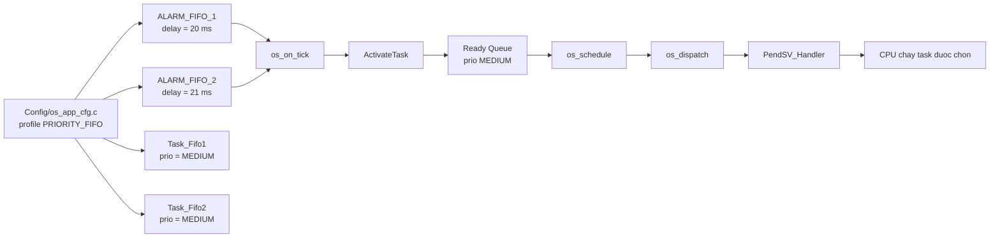

### 3.2. Ý nghĩa sư phạm

- `Config` chỉ mô tả hệ thống.
- `Alarm` chỉ tạo activation.
- `Ready Queue` chỉ giữ task đã sẵn sàng.
- `Scheduler` chỉ quyết định "ai chạy tiếp".
- `PendSV` mới là nơi CPU đổi context thật.

Đây là một điểm dạy rất quan trọng:

**`ActivateTask()` không đồng nghĩa với "CPU chạy task đó ngay".**

---

## 4. Sơ đồ boot và autostart

### 4.1. Sequence diagram giai đoạn boot

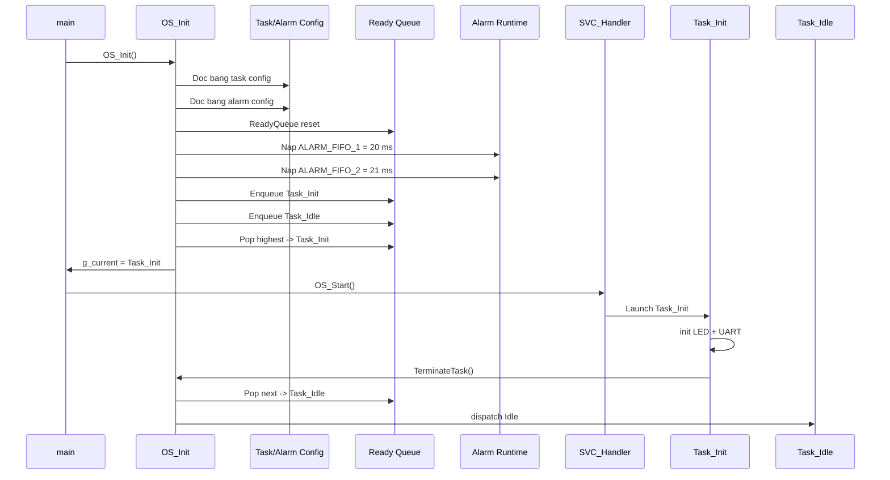

### 4.2. Điều cần nhấn mạnh khi dạy

- `Task_Fifo1` và `Task_Fifo2` chưa có mặt trong ready queue lúc boot.
- Chúng chỉ xuất hiện khi alarm hết hạn.
- `Task_Idle` là ngữ cảnh nền để CPU luôn có thứ chạy.

---

## 5. Sơ đồ cấu hình của scenario `priority_fifo`

### 5.1. Quan hệ giữa profile, alarm và task

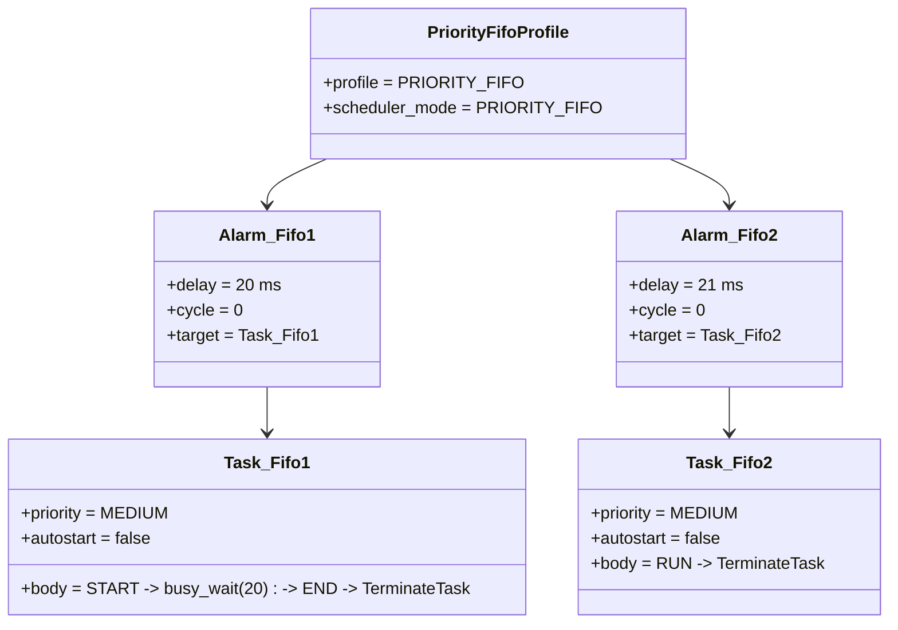

### 5.2. Ý nghĩa

- hai task cùng priority là điều kiện để lộ rõ FIFO
- hai alarm lệch nhau `1 ms` là điều kiện để task sau đến khi task trước vẫn đang chạy

---

## 6. Sơ đồ timeline tổng thể theo tick

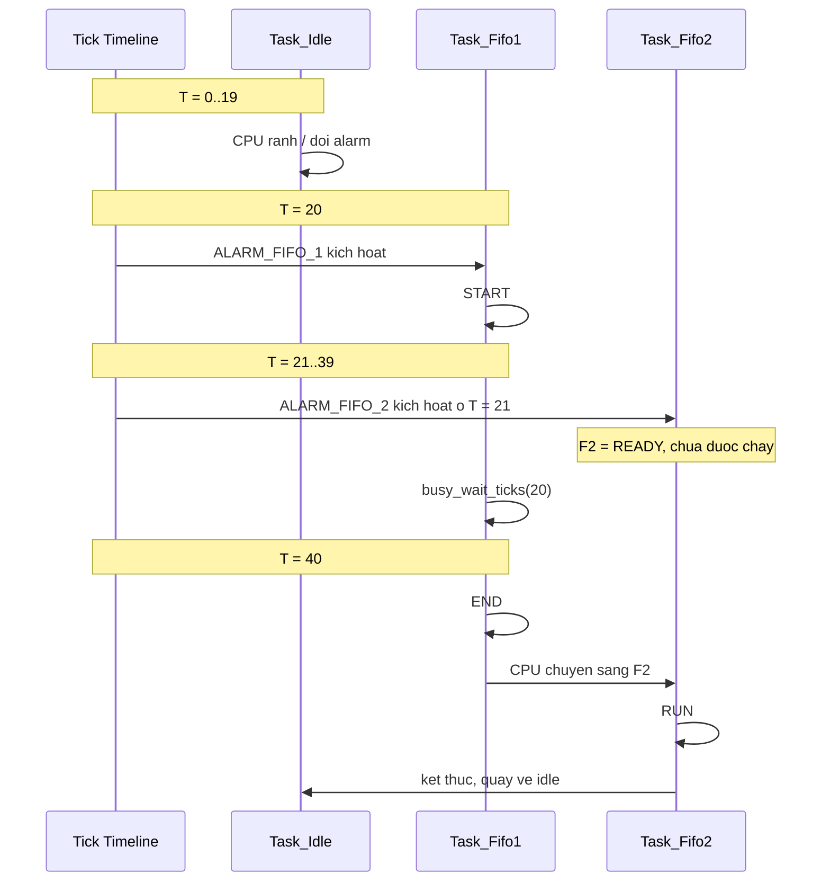

### 6.1. Điểm cần dạy

- `Task_Fifo2` được kích ở `T=21`, nhưng không chạy tại `T=21`.
- Điều học viên thường hiểu sai là "được kích" đồng nghĩa "được chạy".
- Timeline này giúp tách rõ:
  - **activation time**
  - **dispatch time**

---

## 7. Sequence diagram chi tiết tại tick 20

### 7.1. Tick 20: `Task_Fifo1` được đưa từ `DORMANT` sang `RUNNING`

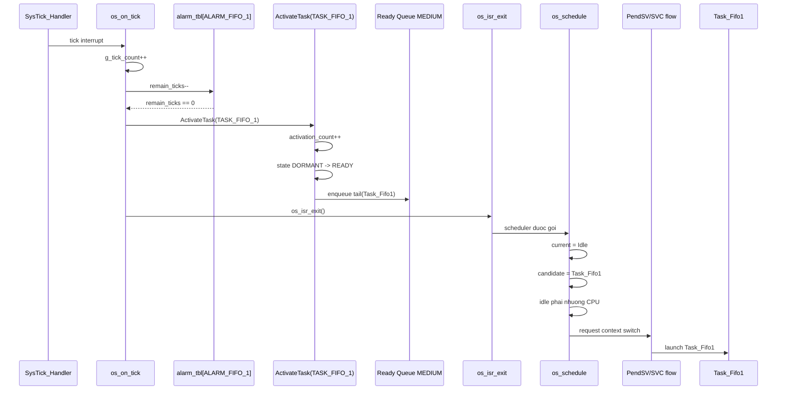

### 7.2. Ý nghĩa

Ở tick `20`, `Task_Fifo1` chạy ngay không phải vì mode `priority_fifo` cho phép preempt thông thường, mà vì:
- current là `Idle`
- kernel có nhánh đặc biệt: nếu current là idle và candidate là task ứng dụng thì phải nhường CPU

Đây là điểm cần nói rõ để học viên không nhầm giữa:
- **rời idle**
- và **preempt task ứng dụng đang chạy**

---

## 8. Sequence diagram chi tiết tại tick 21

### 8.1. Tick 21: `Task_Fifo2` được kích nhưng chưa được chạy

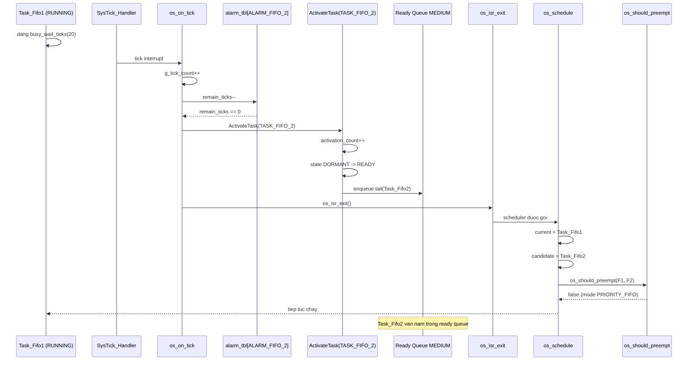

### 8.2. Câu chốt để dạy

Tick `21` là nơi học viên phải hiểu được câu sau:

**`Task_Fifo2` đã READY nhưng chưa RUNNING, vì scheduler mode hiện tại không cho phép cắt ngang `Task_Fifo1`.**

---

## 9. Sequence diagram chi tiết tại tick 40

### 9.1. Tick 40: `Task_Fifo1` kết thúc, `Task_Fifo2` được lấy ra khỏi queue

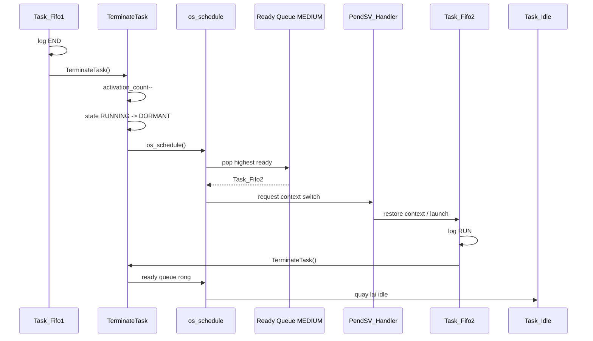

### 9.2. Điểm rất quan trọng

`Task_Fifo2 RUN` có thể xuất hiện cùng tick `40` với `Task_Fifo1 END`.

Điều này đúng vì:
- tick là đơn vị thời gian của OS
- trong cùng tick `40`, có thể xảy ra nhiều bước nhỏ:
  - log `END`
  - `TerminateTask()`
  - `os_schedule()`
  - `PendSV`
  - log `RUN`

---

## 10. State diagram của `Task_Fifo1`

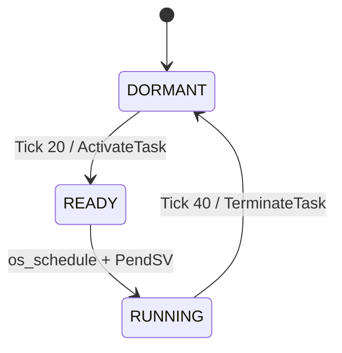

### Ý nghĩa

`Task_Fifo1` không quay về `READY` sau khi chạy xong vì:
- `max_activations = 1`
- alarm là one-shot
- không có activation pending thứ hai

---

## 11. State diagram của `Task_Fifo2`

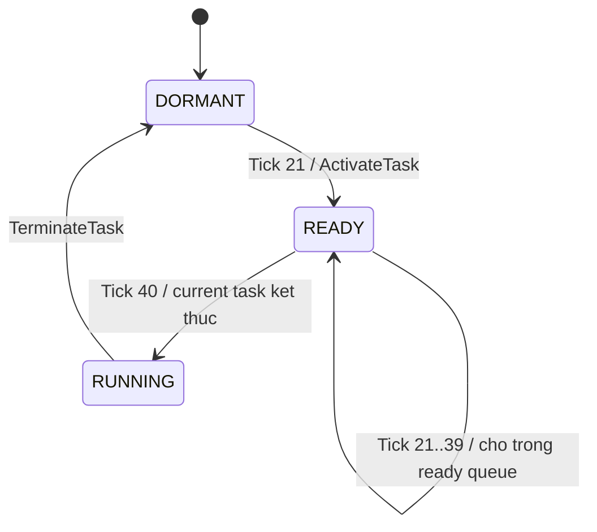

### Ý nghĩa

Đây là state diagram quan trọng nhất của bài:

Nó cho thấy một task có thể:
- đã được kích
- đã `READY`
- nhưng vẫn chưa hề chạy

---

## 12. Sơ đồ activity của `os_schedule()` trong mode `priority_fifo`

### 12.1. Activity diagram

```mermaid
flowchart TD
    A[os_schedule duoc goi] --> B{Dang o ISR nesting<br/>hoac g_next != NULL?}
    B -->|Co| X[Thoat, khong schedule]
    B -->|Khong| C{current == NULL?}
    C -->|Co| X
    C -->|Khong| D{current.state != RUNNING?}

    D -->|Co| E[Pop task ready priority cao nhat]
    E --> F{Co task hop le?}
    F -->|Co| G[Set g_next = next]
    G --> H[Trigger PendSV]
    F -->|Khong| X

    D -->|Khong| I[Peek task ready priority cao nhat]
    I --> J{Co candidate?}
    J -->|Khong| X
    J -->|Co| K[os_should_preempt(current, candidate)]
    K -->|false| X
    K -->|true| L[Requeue current vao dau queue]
    L --> M[Pop candidate]
    M --> G
```

### 12.2. Khi gắn vào scenario `priority_fifo`

- tick `20`: current là `Idle`, nhánh `preempt` hợp lệ vì idle phải nhường CPU
- tick `21`: current là `Task_Fifo1`, candidate là `Task_Fifo2`, `os_should_preempt()` trả `false`
- tick `40`: current không còn `RUNNING`, đi sang nhánh dispatch point và pop `Task_Fifo2`

---

## 13. Sơ đồ activity của `os_should_preempt()`

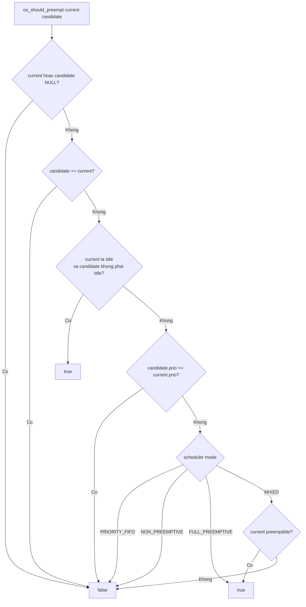

### Ý nghĩa khi dạy bài này

Bài `priority_fifo` chỉ dùng đúng hai nhánh:
- `Idle -> true`
- `PRIORITY_FIFO -> false`

Bạn nên cho học viên thấy điều này để họ hiểu:
- cùng một hàm
- nhưng hành vi thay đổi theo mode

---

## 14. Sơ đồ snapshot ready queue theo từng thời điểm

### 14.1. Snapshot tại tick 19

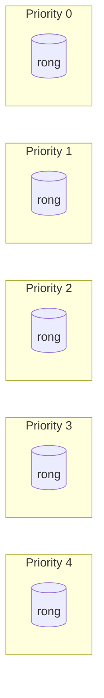

### 14.2. Snapshot ngay sau tick 20

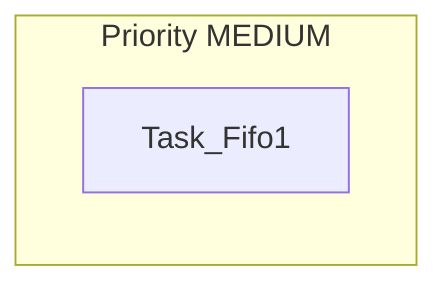

Sau đó scheduler pop `Task_Fifo1`, nên queue lại rỗng và `Task_Fifo1` trở thành `RUNNING`.

### 14.3. Snapshot ngay sau tick 21

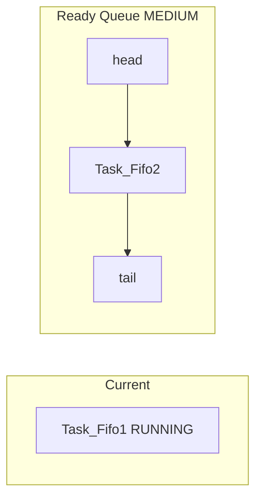

Đây là snapshot quan trọng nhất của bài.

### 14.4. Snapshot tại tick 40 trước khi dispatch

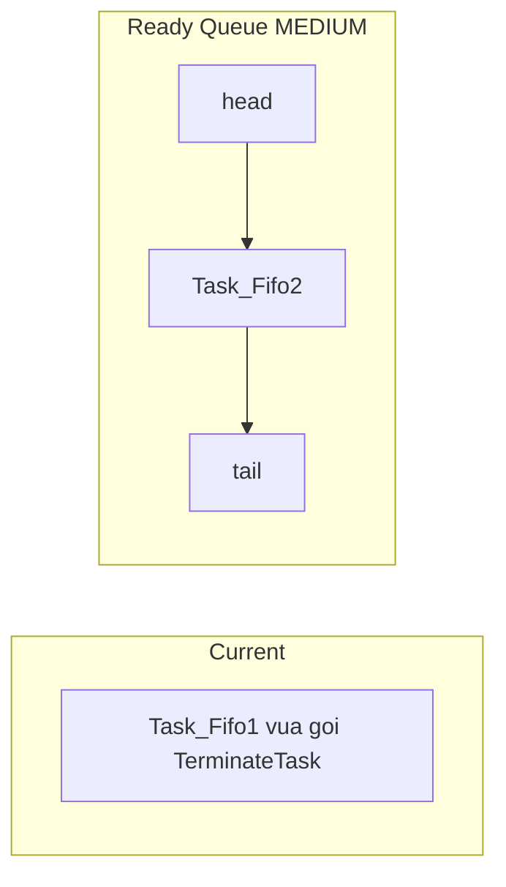

### 14.5. Snapshot tại tick 40 sau khi dispatch

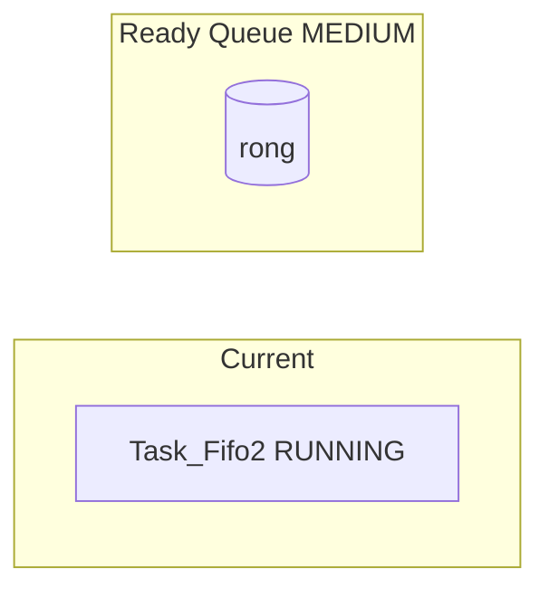

---

## 15. Sơ đồ so sánh 3 khái niệm dễ nhầm

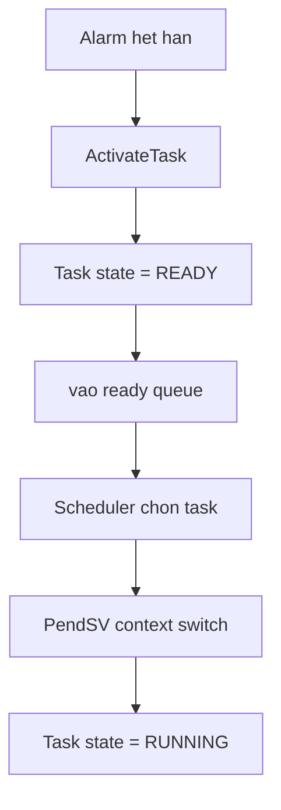

### Câu dạy học rất quan trọng

Không được gộp các bước này thành một ý.

Phải tách đúng:
- alarm hết hạn
- task được activate
- task được enqueue
- scheduler quyết định
- CPU mới thực sự chạy task

---

## 16. Sơ đồ "vì sao không preempt ở tick 21"

```mermaid
flowchart TD
    A[Tick 21] --> B[ALARM_FIFO_2 het han]
    B --> C[ActivateTask(Task_Fifo2)]
    C --> D[Task_Fifo2 -> READY]
    D --> E[enqueue vao queue MEDIUM]
    E --> F[os_schedule duoc goi]
    F --> G[current = Task_Fifo1, candidate = Task_Fifo2]
    G --> H[os_should_preempt = false]
    H --> I[Task_Fifo1 tiep tuc chay]
    I --> J[Task_Fifo2 van READY trong queue]
```

### Kết luận ngắn

Tick `21` là nơi thể hiện "bản chất logic thuật toán".

Nếu học viên hiểu được sơ đồ này, họ sẽ hiểu đúng toàn bài.

---

## 17. Sơ đồ "vì sao lại chạy ở tick 40"

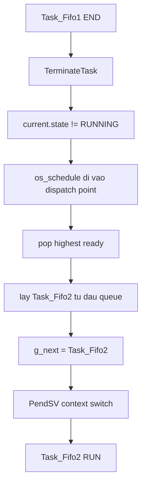

### Ý nghĩa

Ở mode `priority_fifo`, đổi task xảy ra chủ yếu tại:
- task hiện tại kết thúc
- hoặc task hiện tại không còn ở trạng thái `RUNNING`

---

## 18. UML state tổng hợp cho cả hai task

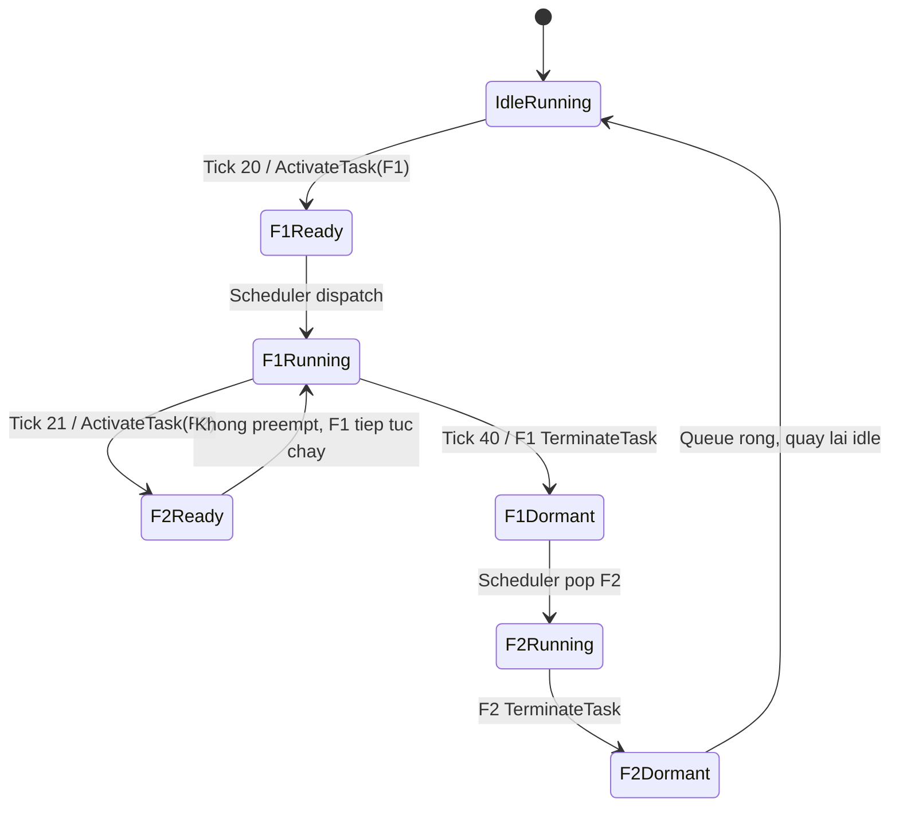

### Cách giảng

Sơ đồ này rất hợp để kết bài vì nó gộp:
- idle
- activation
- waiting in queue
- dispatch
- terminate

thành một mạch duy nhất.

---

## 19. Sơ đồ dạy học so sánh nhanh với `full_preemptive`

Nếu muốn dẫn nhập sang bài kế tiếp, bạn có thể dùng sơ đồ so sánh ngắn này:

```mermaid
flowchart LR
    subgraph PF[PRIORITY_FIFO]
        PF1[Tick 21: F2 READY] --> PF2[Khong preempt]
        PF2 --> PF3[Cho F1 ket thuc]
        PF3 --> PF4[Tick 40: F2 RUN]
    end

    subgraph FP[FULL_PREEMPTIVE]
        FP1[Tick 21: F2 READY] --> FP2[Neu F2 prio cao hon F1]
        FP2 --> FP3[Preempt ngay]
        FP3 --> FP4[F2 RUN tai tick 21]
    end
```

### Ý nghĩa

Cùng một cơ chế `ready queue`, khác nhau ở:
- policy preemption
- thời điểm context switch

---

## 20. Checklist giảng bài trên lớp

### 20.1. Câu mở bài

- "Hai task cùng priority, task đến sau có được chen ngang không?"
- "READY có đồng nghĩa RUNNING không?"

### 20.2. Câu hỏi giữa bài

- Vì sao tick `21` đã có `Task_Fifo2` nhưng CPU vẫn ở `Task_Fifo1`?
- FIFO nằm ở đâu trong code?
- `os_schedule()` ở tick `21` đi nhánh nào?

### 20.3. Câu kết bài

- Nếu đổi sang `FULL_PREEMPTIVE`, sơ đồ nào thay đổi?
- Nếu `Task_Fifo2` có priority cao hơn thì sequence diagram tại tick `21` khác gì?

---

## 21. Kết luận ngắn gọn để chốt bài

Bạn có thể chốt toàn bộ bài học chỉ bằng 4 câu:

1. Alarm chỉ kích hoạt task, không trực tiếp bắt CPU chạy task.
2. Ready queue giữ task sẵn sàng theo thứ tự priority và FIFO.
3. Trong mode `priority_fifo` của project này, task đang chạy không bị task mới cùng priority cắt ngang.
4. Vì vậy `Task_Fifo2` dù được activate ở tick `21` vẫn phải chờ đến khi `Task_Fifo1` terminate ở tick `40`.

---

## 22. Liên kết với bài nền

Tài liệu gốc mô tả chi tiết bằng văn bản:

- [09_Priority_FIFO_Manual_Test_Flow.md](./09_Priority_FIFO_Manual_Test_Flow.md)

Tài liệu này là bản "dạy bằng sơ đồ" của chính flow đó.
