# Chi Tiết Các Thuật Toán Lập Lịch Trong OSEK-RTOS

## Mục Lục
1. [Giới Thiệu](#giới-thiệu)
2. [Thuật Toán 1: Priority-Based Scheduling (FIFO)](#thuật-toán-1-priority-based-scheduling-fifo)
3. [Thuật Toán 2: Full Preemptive Scheduling](#thuật-toán-2-full-preemptive-scheduling)
4. [Thuật Toán 3: Non-Preemptive Scheduling](#thuật-toán-3-non-preemptive-scheduling)
5. [Thuật Toán 4: Mixed Scheduling](#thuật-toán-4-mixed-scheduling)
6. [Thuật Toán 5: Time-Triggered Scheduling (ScheduleTable)](#thuật-toán-5-time-triggered-scheduling-scheduletable)
7. [Bảng So Sánh](#bảng-so-sánh)
8. [Hướng Dẫn Lựa Chọn](#hướng-dẫn-lựa-chọn)

---

## Giới Thiệu

Trong OSEK-RTOS, bộ lập lịch (scheduler) là trái tim của hệ điều hành. Nó quyết định task nào sẽ được CPU thực thi vào thời điểm nào. Có 5 thuật toán lập lịch chính trong OSEK-RTOS:

1. **Priority-Based Scheduling (FIFO)**: Chọn task có độ ưu tiên cao nhất, cùng priority thì FIFO
2. **Full Preemptive**: Task mới có priority cao hơn có thể ngay lập tức chiếm giật (preempt) task hiện tại
3. **Non-Preemptive**: Task đang chạy không bị chiếm giật cho đến khi tự kết thúc hoặc block
4. **Mixed**: Một số task preemptible, một số không
5. **Time-Triggered (ScheduleTable)**: Tầng thứ hai, lên lịch task theo thời gian xác định, độc lập với priority

---

## Thuật Toán 1: Priority-Based Scheduling (FIFO)

### Mô Tả Sinh Động

Tưởng tượng một **cửa hàng phục vụ ping-pong** với nhiều hàng chờ (queue), mỗi hàng ứng với một mức độ ưu tiên:
- Hàng VIP (Priority 3): Khách hàng cao cấp
- Hàng thường (Priority 2) 
- Hàng bình dân (Priority 1)
- Hàng ngoài (Priority 0): Khách chờ tối thiểu

**Luật phục vụ**:
1. Luôn phục vụ hàng VIP trước (nếu có người)
2. Nếu VIP hết, sang hàng thường
3. Trong cùng một hàng, phục vụ theo thứ tự đến (FIFO)

### Chi Tiết Kỹ Thuật

**Structure dữ liệu**:
```c
/* Mỗi priority level có một queue riêng */
typedef struct {
    uint16 head;           /* Chỉ số task đầu hàng */
    uint16 tail;           /* Chỉ số task cuối hàng */
    uint16 count;          /* Số task trong queue */
} Os_ReadyQueue_t;

/* Mảng task queue cho mỗi priority level */
Os_ReadyQueue_t Os_ReadyQueues[OS_PRIORITY_COUNT];

/* Mảng check nhanh: task đang ở queue nào */
uint8 Os_TaskQueued[OS_TASK_COUNT];
```

**Luật chọn task**:
```c
task_id_t Os_GetHighestPriorityReady(void) {
    /* Quét từ priority cao đến thấp */
    for (int prio = OS_PRIORITY_COUNT - 1; prio >= 0; prio--) {
        if (Os_ReadyQueues[prio].count > 0) {
            /* Lấy task đầu queue của priority này */
            uint16 idx = Os_ReadyQueues[prio].head;
            return Os_TaskTbl[idx].id;
        }
    }
    /* Không có task ready → chạy Idle task */
    return IDLE_TASK_ID;
}
```

**Flow Diagram Chi Tiết**:

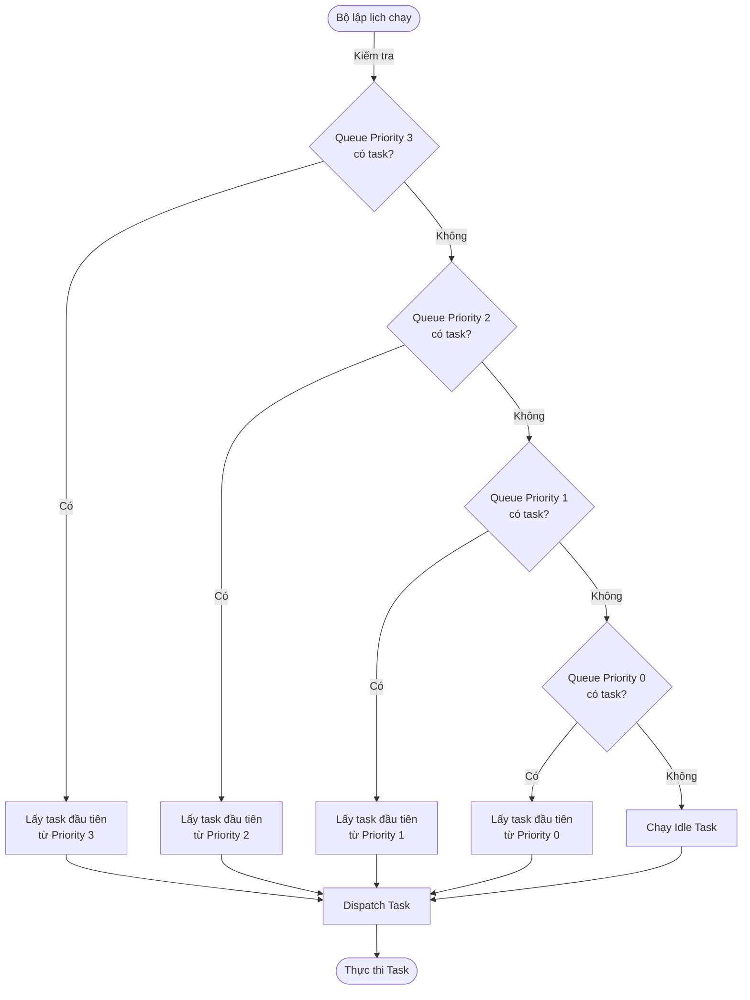

**Ví Dụ Minh Họa**:

```
Thời gian T1:
┌────────────────────────────────────────┐
│ Priority 3: [Task_HighFreq]            │
│ Priority 2: [Task_IO_Handler, Task_DB] │
│ Priority 1: [Task_Comm]                │
│ Priority 0: [Task_Idle]                │
└────────────────────────────────────────┘
➜ Chạy: Task_HighFreq

Thời gian T2 (Task_HighFreq kết thúc):
┌────────────────────────────────────────┐
│ Priority 3: [rỗng]                     │
│ Priority 2: [Task_IO_Handler, Task_DB] │
│ Priority 1: [Task_Comm]                │
│ Priority 0: [Task_Idle]                │
└────────────────────────────────────────┘
➜ Chạy: Task_IO_Handler

Thời gian T3 (Task_IO_Handler kết thúc):
┌────────────────────────────────────────┐
│ Priority 3: [rỗng]                     │
│ Priority 2: [Task_DB]                  │
│ Priority 1: [Task_Comm]                │
│ Priority 0: [Task_Idle]                │
└────────────────────────────────────────┘
➜ Chạy: Task_DB
```

### UML Sequence Diagram

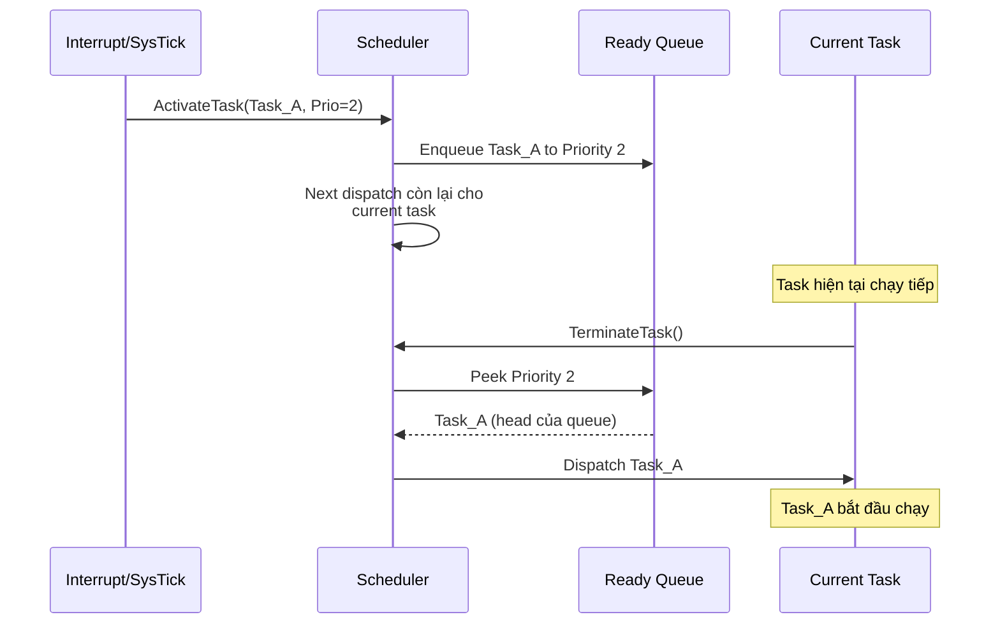

### Code Minh Họa Từ Source

```c
/* File: autosar/services/system/os/kernel/src/Os_Internal.c */

void Os_ReadyQueueAdd(task_id_t task_id, uint8 prio) {
    Os_TaskCbType *tcb = &Os_TaskTbl[task_id];
    
    /* Kiểm tra task chưa được queue */
    if (Os_TaskQueued[task_id] == TRUE) {
        return;  /* Đã trong queue, không enqueue lại */
    }
    
    /* Thêm vào cuối queue của priority này */
    uint16 tail = Os_ReadyQueues[prio].tail;
    Os_TaskQueue[prio][tail] = task_id;
    Os_ReadyQueues[prio].tail = (tail + 1) % QUEUE_SIZE;
    Os_ReadyQueues[prio].count++;
    Os_TaskQueued[task_id] = TRUE;
}

task_id_t Os_ReadyQueuePop(uint8 prio) {
    if (Os_ReadyQueues[prio].count == 0) {
        return INVALID_TASK;
    }
    
    uint16 head = Os_ReadyQueues[prio].head;
    task_id_t task_id = Os_TaskQueue[prio][head];
    
    Os_ReadyQueues[prio].head = (head + 1) % QUEUE_SIZE;
    Os_ReadyQueues[prio].count--;
    Os_TaskQueued[task_id] = FALSE;
    
    return task_id;
}

task_id_t Os_Scheduler(void) {
    /* Lấy task có priority cao nhất */
    for (int prio = OS_PRIORITY_COUNT - 1; prio >= 0; prio--) {
        if (Os_ReadyQueues[prio].count > 0) {
            return Os_ReadyQueuePop(prio);
        }
    }
    return IDLE_TASK_ID;
}
```

### Ưu Điểm

✅ **Đơn giản**: Dễ hiểu, dễ triển khai  
✅ **Deterministic**: Luôn chọn task với priority cao nhất, dự đoán được hành vi  
✅ **Không overhead**: Không cần quét nhiều cấu trúc dữ liệu phức tạp  
✅ **Fair**: Trong cùng priority, FIFO đảm bảo công bằng  

### Nhược Điểm

❌ **Không preemption**: Task thấp priority có thể block toàn bộ task cao priority nếu không kết thúc  
❌ **Priority inversion**: Task cao priority phải chờ task thấp priority if not careful  
❌ **Starvation**: Task thấp priority có thể chờ vô hạn nếu task cao priority liên tục  

### Trường Hợp Ứng Dụng

**Khi nào sử dụng**:
- Hệ thống với **yêu cầu latency tuyệt đối** (automotive, medical)
- **Số task ít** (< 10)
- Các task **tự kết thúc nhanh** (không block)
- **Không cần time-sharing** giữa các priority level

**Ví dụ thực tế**:
- Hệ thống điều khiển động cơ: Priority cao = ISR xử lý cảm biến, Priority thấp = task ghi log
- Hệ thống đốc công: Priority cao = task tính toán, Priority thấp = task giao tiếp

---

## Thuật Toán 2: Full Preemptive Scheduling

### Mô Tả Sinh Động

Tưởng tượng một **cuộc họp công ty** với nhiều mức độ ưu tiên:
- **Ông chủ công ty** (Priority 3): Có thể ngắt bất cứ ai để phát biểu
- **Trưởng phòng** (Priority 2): Có thể ngắt nhân viên bình thường
- **Nhân viên** (Priority 1): Phục vụ những người cao hơn
- **Nhân viên vệ sinh** (Priority 0): Chỉ làm việc khi không ai khác

Nếu **Ông chủ** bất ngờ vào phòng, người đang phát biểu sẽ **dừng ngay lập tức**, nhường chỗ cho Ông chủ. Khi Ông chủ xong, người vừa dừng lại **tiếp tục từ vị trí cũ**.

### Chi Tiết Kỹ Thuật

**Điều kiện Preemption**:

```c
/* Preemption xảy ra khi tất cả điều kiện đúng */
if (
    ready_prio > current_prio &&              /* Task ready có priority cao hơn */
    !in_isr &&                                 /* Không đang trong ISR */
    current_task->preemptible &&               /* Task hiện tại có thể bị preempt */
    !pending_dispatch                          /* Không có dispatch khác đang pending */
) {
    /* Trigger preemption */
    preempt_current_task();
}
```

**Flow Chi Tiết Khi Preemption Xảy Ra**:

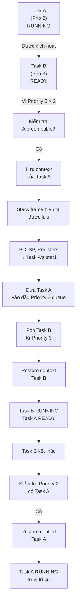

**Memory Layout Tinh Vi**:

```
Khi Task A preempt diễn ra:

Stack Task A (trước preemption):
┌──────────────────┐
│ Local var 1..N   │ ← SP_A (trước)
│ Return address   │
│ Task A context   │ ← Được PendSV lưu
└──────────────────┘

Lúc Task B chạy:
┌──────────────────┐
│ Local var 1..M   │ ← SP_B
│ Return address   │
│ Task B context   │
└──────────────────┘

Khi Task B kết thúc, Task A resume:
┌──────────────────┐
│ Local var 1..N   │ ← SP_A (restore)
│ Return address   │ ← Tiếp tục từ đây
│ Task A context   │ ← Được PendSV restore
└──────────────────┘
```

### UML Sequence Diagram

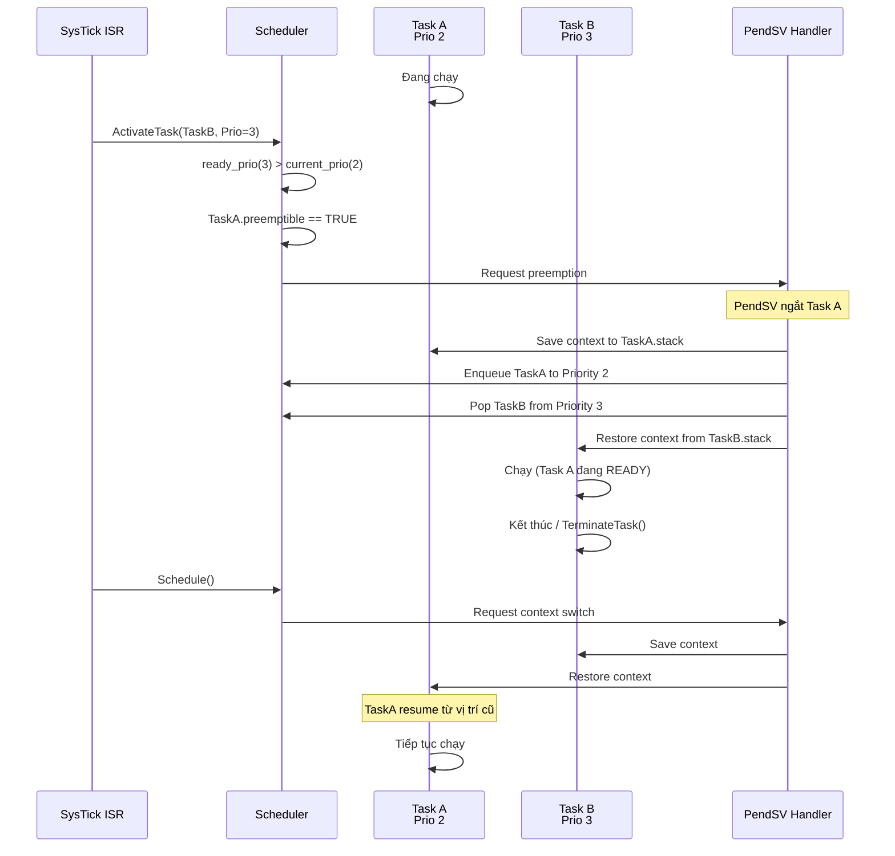

### Code Minh Họa Từ Source

```c
/* File: autosar/services/system/os/kernel/src/Os_Kernel.c */

void Os_Scheduler(void) {
    task_id_t next_task_id;
    uint8 next_prio;
    uint8 current_prio;
    
    /* Lấy task có priority cao nhất ready */
    next_task_id = Os_GetHighestPriorityReady();
    next_prio = Os_TaskTbl[next_task_id].prio;
    
    /* Nếu current task cũng đó, không có gì thay đổi */
    if (next_task_id == Os_CurrentTask) {
        return;
    }
    
    current_prio = Os_TaskTbl[Os_CurrentTask].prio;
    
    /* ========== PREEMPTION CHECK ========== */
    if (Os_IsInISR == FALSE &&              /* Không trong ISR */
        next_prio > current_prio &&         /* Priority cao hơn */
        Os_TaskTbl[Os_CurrentTask].preemptible == TRUE) {  /* Task hiện tại preemptible */
        
        /* Đưa current task vào READY state đầu queue (AddFront) */
        Os_TaskTbl[Os_CurrentTask].state = TASK_READY;
        Os_ReadyQueueAddFront(Os_CurrentTask, current_prio);
        
        /* Pop task mới từ ready queue */
        Os_NextTask = next_task_id;
        
        /* Trigger PendSV để context switch */
        SCB->ICSR |= SCB_ICSR_PENDSVSET_Msk;  /* Request PendSV interrupt */
        
        return;
    }
    
    /* Nếu không preempt, normal dispatch khi task kết thúc */
    Os_NextTask = next_task_id;
    SCB->ICSR |= SCB_ICSR_PENDSVSET_Msk;
}

/* PendSV handler thực hiện context switch */
void PendSV_Handler(void) {
    if (Os_CurrentTask != INVALID_TASK) {
        /* Lưu context task hiện tại */
        save_context(&Os_TaskTbl[Os_CurrentTask].stack_ptr);
    }
    
    /* Chuyển sang task mới */
    Os_CurrentTask = Os_NextTask;
    Os_TaskTbl[Os_CurrentTask].state = TASK_RUNNING;
    
    /* Restore context task mới */
    restore_context(Os_TaskTbl[Os_CurrentTask].stack_ptr);
}
```

### Ưu Điểm

✅ **Latency thấp**: Task cao priority bị kích động sẽ chạy ngay (không phải chờ task thấp kết thúc)  
✅ **Responsiveness cao**: Hệ thống nhanh phản ứng với sự kiện khẩn cấp  
✅ **Công bằng**: Không có starvation, mỗi task có cơ hội chạy  
✅ **Phù hợp real-time**: Đảm bảo deadline cho các task quan trọng  

### Nhược Điểm

❌ **Overhead cao**: Mỗi lần preemption phải save/restore context (tốn CPU cycles)  
❌ **Complexity**: Code phức tạp hơn, dễ có race condition  
❌ **Cache thrashing**: Context switch thường xuyên làm cache bị invalidate  
❌ **Energy**: Kernel hoạt động nhiều hơn, tốn năng lượng trên thiết bị pin  

### Trường Hợp Ứng Dụng

**Khi nào sử dụng**:
- **Hệ thống thời gian thực cứng** (hard real-time)
- **Yêu cầu latency tuyệt đối** (< 10ms)
- **Nhiều task khác nhau, không đồng thời**
- **Có sự kiện bất ngờ cần xử lý ngay**

**Ví dụ thực tế**:
- **Hệ thống xe hơi**: ISR xử lý va chạm (Priority 3) preempt task ghi log (Priority 1)
- **Thiết bị y tế**: ISR phát hiện nhịp tim bất thường preempt task liên lạc với bác sĩ
- **Robot**: Cảm biến tránh vật cản (Priority 3) preempt task di chuyển (Priority 2)

---

## Thuật Toán 3: Non-Preemptive Scheduling

### Mô Tả Sinh Động

Tưởng tượng một **nhà hát với các suất chiếu ưu tiên**:
- **Suất VIP** (Priority 3): Được chiếu đầu tiên
- **Suất thường** (Priority 2)
- **Suất giá rẻ** (Priority 1)
- **Suất tàn canh** (Priority 0): Khi không ai khác

**Luật hoạt động**:
- Khi một suất đang chiếu, **không ai có thể ngắt giữa chừng**, dù suất VIP đặt vé
- Phải **chờ suất hiện tại kết thúc** hoặc **tự kết thúc sớm** mới chuyển sang suất tiếp theo
- Suất VIP chỉ chiếu khi suất trước kết thúc

### Chi Tiết Kỹ Thuật

**Điều kiện Schedule (không preemption)**:

```c
/* Schedule chỉ xảy ra khi: */
if (
    current_task_terminated ||               /* Task hiện tại kết thúc */
    current_task_blocked_on_event ||         /* Task hiện tại chặn (chờ event) */
    !IsInISR                                 /* Không trong ISR */
) {
    /* Chọn task ready có priority cao nhất */
    next_task = SelectHighestPriorityReady();
    dispatch(next_task);
}
```

**Flow Chi Tiết**:

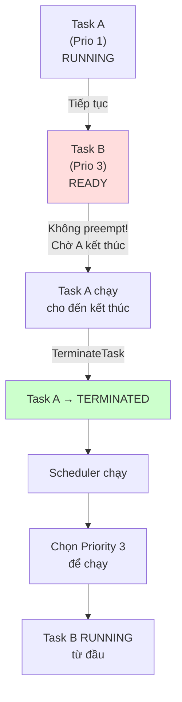

**Lưu ý quan trọng: Nếu Task kích hoạt khi đang ISR**:

```
Thời gian:
T0: Task A (Prio 1) đang RUNNING
T1: ISR xảy ra, ActivateTask(Task B, Prio 3)
    → Task B vào READY queue
    → Nhưng Task A vẫn RUNNING (không preempt)
T2: IRQ xong, quay lại Task A
T3: Task A công việc xong/block, TerminateTask()
T4: Scheduler chạy, chọn Task B (Prio 3 cao nhất)
T5: Task B RUNNING
```

### UML Sequence Diagram

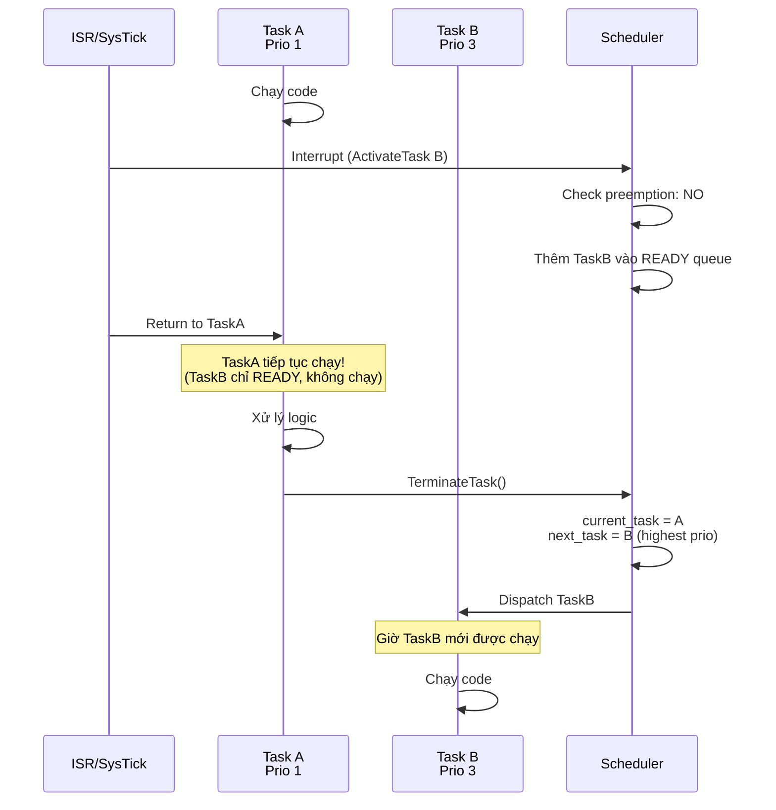

### Code Minh Họa

```c
/* File: autosar/services/system/os/kernel/src/Os_Task.c */

StatusType Os_TerminateTask(void) {
    task_id_t current = Os_CurrentTask;
    
    /* Kiểm tra scheduler lock */
    if (Os_IsSchedulerLocked()) {
        return E_OS_CALLEVEL;  /* Không được gọi từ ISR */
    }
    
    /* Đặt state thành TERMINATED */
    Os_TaskTbl[current].state = TASK_TERMINATED;
    Os_TaskTbl[current].activation_count = 0;
    
    /* ===== DISPATCH POINT ===== */
    /* Đây là nơi duy nhất (bên cạnh ISR) mà scheduler chạy */
    Os_Schedule();  /* Chọn task cao nhất để chạy tiếp */
    
    /* Nếu không có task ready, chạy Idle task */
    if (Os_CurrentTask == INVALID_TASK) {
        Os_CurrentTask = IDLE_TASK;
    }
    
    return E_OS_OK;
}

/* Schedule() trong non-preemptive */
void Os_Schedule(void) {
    if (Os_IsInISR == TRUE) {
        /* ISR không gọi Schedule trực tiếp; ISR exit sẽ handle */
        return;
    }
    
    /* Lấy task ready có priority cao nhất */
    task_id_t next = Os_GetHighestPriorityReady();
    
    /* Nếu task đó khác task hiện tại */
    if (next != Os_CurrentTask) {
        Os_NextTask = next;
        RequestContextSwitch();  /* Trigger PendSV */
    }
}

/* Khi Task muốn chờ một sự kiện */
StatusType Os_WaitEvent(EventMaskType mask) {
    task_id_t current = Os_CurrentTask;
    
    /* Đặt state thành WAITING_EVENT */
    Os_TaskTbl[current].state = TASK_WAITING;
    Os_TaskTbl[current].waiting_event_mask = mask;
    
    /* ===== DISPATCH POINT ===== */
    Os_Schedule();  /* Chọn task khác để chạy */
    
    return E_OS_OK;
}
```

### Ưu Điểm

✅ **Đơn giản implementation**: Ít context switch overhead  
✅ **Cache-friendly**: Context ổn định, cache bị invalidate ít  
✅ **Energy-efficient**: Ít interrupt/PendSV, tốn ít năng lượng  
✅ **Dễ debug**: Hành vi dự đoán được, ít race condition  
✅ **Overhead thấp**: Ideal cho hệ thống embedded nhỏ  

### Nhược Điểm

❌ **Latency cao**: Task cao priority phải chờ task thấp kết thúc  
❌ **Priority inversion**: Nếu task thấp không kết thúc, task cao block  
❌ **Starvation khả thi**: Task thấp priority có thể chờ vô hạn  
❌ **Responsiveness kém**: Hệ thống phản ứng chậm với sự kiện khẩn cấp  
❌ **Không phù hợp real-time hard**: Không đáp ứng deadline cứng  

### Trường Hợp Ứng Dụng

**Khi nào sử dụng**:
- **Hệ thống embedded nhỏ**: Microwave, máy giặt cơ bản
- **Yêu cầu latency không cứng**: Soft real-time OK
- **Ít task, ít sự kiện**: < 5 task, sự kiện hiếm khi xảy ra
- **Năng lượng giới hạn**: IoT devices, sensor nodes

**Ví dụ thực tế**:
- **Đồng hồ thông minh**: Task cập nhật display (Prio 1) không bị ngắt Task đo nhịp tim (Prio 2)
- **Máy giặt**: Task xoay lồng (Prio 1) không bị ngắt Task khuấy nước (Prio 2)
- **Cảm biến IoT**: Task đọc dữ liệu (Prio 2) chạy xong rồi mới Task gửi dữ liệu (Prio 1)

---

## Thuật Toán 4: Mixed Scheduling

### Mô Tả Sinh Động

Tưởng tượng một **bệnh viện emergency** với hai khu vực:
- **Khu A (Preemptible)**: Các bác sĩ thường có thể bị gọi đi xử lý trường hợp khẩn cấp
- **Khu B (Non-Preemptible)**: Các bác sĩ phẫu thuật không thể bị ngắt giữa chừng

**Luật hoạt động**:
- Bác sĩ từ Khu B (ca phẫu thuật) được ưu tiên, không bị ngắt
- Bác sĩ từ Khu A (thăm khám) có thể bị kích hoạt dừng ngay để chạy chuyên cấp
- Nếu Khu B bận, Khu A có cơ hội
- Task không bị preempt nếu nó non-preemptible, dù có task cao priority

### Chi Tiết Kỹ Thuật

**Cấu trúc Task Configuration**:

```c
typedef struct {
    TaskType id;
    uint8 priority
    TaskTypeEnum type;  /* TASK_PREEMPTIVE hoặc TASK_NON_PREEMPTIVE */
    boolean preemptible;  /* Derived from type */
} Os_TaskConfigType;

/* Configuration */
Os_TaskConfigType Os_TaskConfig[OS_TASK_COUNT] = {
    {
        .id = Task_CriticalWork,
        .priority = 3,
        .type = TASK_NON_PREEMPTIVE,  /* Không bị preempt */
        .preemptible = FALSE
    },
    {
        .id = Task_Communication,
        .priority = 2,
        .type = TASK_PREEMPTIVE,  /* Có thể bị preempt */
        .preemptible = TRUE
    },
    {
        .id = Task_Logging,
        .priority = 1,
        .type = TASK_PREEMPTIVE,
        .preemptible = TRUE
    }
};
```

**Logic Scheduler Chi Tiết**:

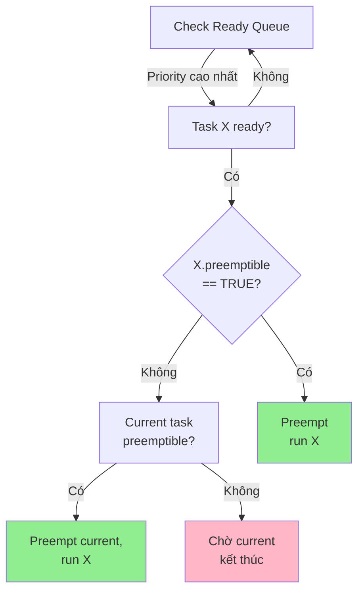

**Ưu tiên Non-Preemptive**:

```
Scenario:
T0: Task NonPre (Prio 2, non-preemptible) đang RUNNING
T1: ActivateTask(PreTask, Prio 3, preemptible)
    → PreTask READY
    → Kiểm tra: NonPre.preemptible = FALSE
    → VẬY: NonPre tiếp tục chạy!
T2: NonPre kết thúc/block
T3: Scheduler: chọn PreTask (Prio 3 cao nhất)
T4: PreTask RUNNING
```

### UML Sequence Diagram

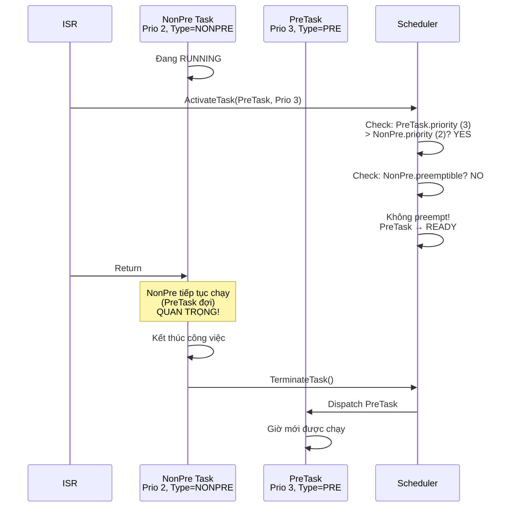

### Code Minh Họa

```c
/* File: autosar/services/system/os/kernel/src/Os_Kernel.c */

void Os_Scheduler(void) {
    task_id_t next_task_id = Os_GetHighestPriorityReady();
    uint8 next_prio = Os_TaskTbl[next_task_id].priority;
    uint8 current_prio = Os_TaskTbl[Os_CurrentTask].priority;
    
    if (next_task_id == Os_CurrentTask) {
        return;  /* Không có thay đổi */
    }
    
    /* ===== MIXED SCHEDULING LOGIC ===== */
    boolean can_preempt = FALSE;
    
    /* Điều kiện preemption */
    if (
        Os_IsInISR == FALSE &&                          /* Không trong ISR */
        next_prio > current_prio &&                     /* Task ready priority cao hơn */
        Os_TaskTbl[Os_CurrentTask].preemptible == TRUE  /* Task hiện tại preemptible */
    ) {
        can_preempt = TRUE;
    }
    
    if (can_preempt) {
        /* Preempt current task */
        Os_TaskTbl[Os_CurrentTask].state = TASK_READY;
        Os_ReadyQueueAddFront(Os_CurrentTask, current_prio);
        Os_NextTask = next_task_id;
        RequestContextSwitch();
    } else {
        /* Non-preemptive: chưa dispatch, chờ dispatch point */
        Os_NextTask = next_task_id;
        /* Chỉ dispatch ở dispatch point (context switch call) */
    }
}

StatusType Os_ActivateTask(TaskType task_id) {
    Os_TaskCbType *tcb = &Os_TaskTbl[task_id];
    
    /* Đúc/activate task, thêm vào ready queue */
    if (tcb->activation_count >= tcb->max_activation) {
        return E_OS_LIMIT;
    }
    
    tcb->activation_count++;
    tcb->state = TASK_READY;
    Os_ReadyQueueAdd(task_id, tcb->priority);
    
    /* ===== CHECK PREEMPTION (Mixed) ===== */
    if (!Os_IsInISR && tcb->priority > Os_TaskTbl[Os_CurrentTask].priority) {
        if (Os_TaskTbl[Os_CurrentTask].preemptible == TRUE) {
            /* Trigger preemption ngay */
            Os_Scheduler();
        }
        /* Nếu current non-preemptible, chỉ trigger khi dispatch point */
    }
    
    return E_OS_OK;
}
```

### Ưu Điểm

✅ **Linh hoạt**: Tuỳ chỉnh preemption cho từng task  
✅ **Thận trọng**: Bảo vệ section tới hạn mà không cần lock  
✅ **Công bằng + Responsiveness**: Cân bằng hai yếu tố  
✅ **Hiệu năng**: Có thể chọn preemptible cho non-critical task  
✅ **Tinh gọn**: Ít overhead hơn full preemptive  

### Nhược Điểm

❌ **Complexity cao**: Cấu hình khó khăn, dễ lỗi  
❌ **Debug khó**: Hành vi phức tạp, race condition tinh tế  
❌ **Latency không đều**: Một số task latency khác nhau  
❌ **Yêu cầu kiểm tra kỹ**: Cần test coverage cao  

### Trường Hợp Ứng Dụng

**Khi nào sử dụng**:
- **Hệ thống hybrid**: Có cả task tới hạn và task bình thường
- **Bảo vệ section tới hạn**: Thay vì dùng mutex, dùng non-preemptible
- **Hệ thống lớn**: 10+ task, ưu tiên khác nhau
- **Yêu cầu mixed latency**: Một số cao, một số không

**Ví dụ thực tế**:
- **Hệ thống xe hơi**:
  - Non-preemptible: Task điều khiển động cơ (Prio 3, type=NONPRE)
  - Preemptible: Task giao tiếp CAN (Prio 2, type=PRE)
  - Preemptible: Task ghi log (Prio 1, type=PRE)

- **Robot tự hành**:
  - Non-preemptible: Task xử lý IMU sensor (Prio 2, sẽ phải xử lý event dòng liên tục)
  - Preemptible: Task remote control (Prio 3, có thể bị nhả ra giữa chừng)

---

## Thuật Toán 5: Time-Triggered Scheduling (ScheduleTable)

### Mô Tả Sinh Động

Tưởng tượng một **lịch trình xe buýt chuyên biệt**:
- **Tuyến A**: 0h chở người đi làm, 6h20 chở người về nhà, 12h chở người ăn trưa
- **Tuyến B**: 1h, 7h30, 13h15
- Không phụ thuộc vào bao nhiêu người, lịch này **cứ theo giờ mà chạy**

Tương tự, **ScheduleTable** không phụ thuộc priority hay sự kiện, mà chạy **theo thời gian xác định** (tick).

### Chi Tiết Kỹ Thuật

**Cấu trúc ScheduleTable**:

```c
typedef struct {
    /* Mô tả chung */
    uint32 id;
    counter_t *counter_ref;              /* Counter (cục bộ, global) */
    boolean is_repeating;                /* Lặp lại hay chạy một lần */
    
    /* Bản ghi expiry points */
    uint32 num_expiry_points;
    Os_ScheduleTableExpirePoint_t *expiry_points;
    
    /* Trạng thái runtime */
    Os_ScheduleTableStateType current_state;  /* STOPPED, RUNNING, NEXT, ... */
    TickType current_offset;
    uint32 current_expiry_idx;           /* Expiry point hiện tại */
} Os_ScheduleTableType;

typedef struct {
    /* Offset từ đầu chu kỳ */
    TickType offset;
    
    /* Hành động tại offset này */
    struct {
        TaskType task_id;               /* NULL nếu không activate task */
        EventMaskType event_mask;       /* NULL nếu không set event */
        void (*callback)(void);         /* NULL nếu không callback */
    } action;
} Os_ScheduleTableExpirePoint_t;

/* Ví dụ configuration */
Os_ScheduleTableExpirePoint_t schedule_points[] = {
    {
        .offset = 0,
        .action = {.task_id = Task_HighFreq, .event_mask = 0}
    },
    {
        .offset = 5,
        .action = {.task_id = Task_Sensor, .event_mask = EVENT_DATA_READY}
    },
    {
        .offset = 10,
        .action = {.task_id = Task_Log, .event_mask = 0}
    }
};

Os_ScheduleTableType ScheduleTable0 = {
    .id = 0,
    .counter_ref = &SystemCounter,
    .is_repeating = TRUE,
    .expiry_points = schedule_points,
    .num_expiry_points = 3
};
```

**Flow Chi Tiết Khi Counter Tick**:

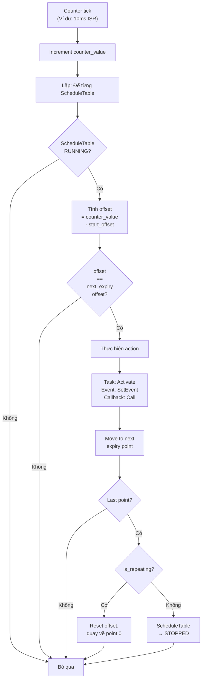

**Ví Dụ Timeline**:

```
ScheduleTable (chu kỳ 20ms, is_repeating=TRUE):
  T=0ms:   offset=0,  action=ActivateTask(A)
  T=5ms:   offset=5,  action=SetEvent(Task B, EVENT_1)
  T=10ms:  offset=10, action=ActivateTask(C)
  T=20ms:  offset=20, action=(none), quay về T=0ms, lặp lại


Timeline thực tế:
┌────────────────────────────────────────────────────────┐
│ ST0 | Tick |  Counter  | Offset | Action               │
├────────────────────────────────────────────────────────┤
│     │  0   │     0     │   0    │ ActivateTask(A)      │
│ ST0 │  5   │     5     │   5    │ SetEvent(B, EV_1)    │
│ RUN │  10  │    10     │  10    │ ActivateTask(C)      │
│     │  15  │    15     │  15    │ (none, wait)         │
│     │  20  │    20     │   0    │ ActivateTask(A)      │ ← Reset, repeat
│     │  25  │    25     │   5    │ SetEvent(B, EV_1)    │
│     │  ...                                             │
└────────────────────────────────────────────────────────┘
```

### UML Sequence Diagram

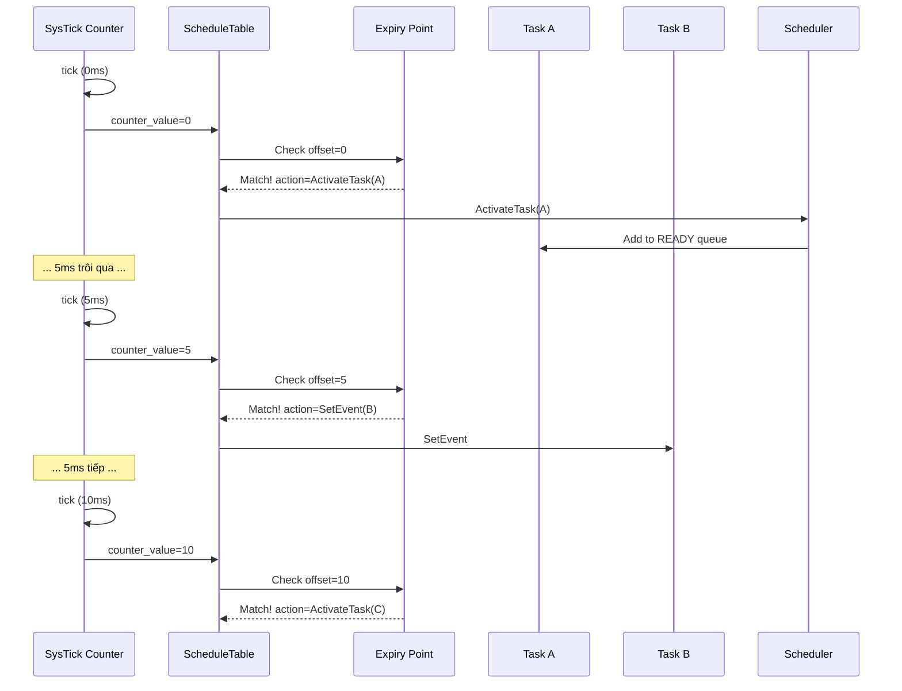

### Code Minh Họa Từ Source

```c
/* File: autosar/services/system/os/kernel/src/Os_ScheduleTable.c */

void Os_ScheduleTableTick(void) {
    /* Gọi từ Counter increment (thường từ SysTick ISR) */
    
    for (int st_id = 0; st_id < OS_SCHTBL_COUNT; st_id++) {
        Os_ScheduleTableType *st = &Os_ScheduleTable[st_id];
        
        if (st->current_state != SCHEDULETABLE_RUNNING) {
            continue;  /* Bỏ qua ScheduleTable không chạy */
        }
        
        /* Tính offset từ lúc start */
        TickType current_offset = counter->current_value - st->start_offset;
        
        /* Kiểm tra từng expiry point */
        while (st->current_expiry_idx < st->num_expiry_points) {
            Os_ScheduleTableExpirePoint_t *ep = 
                &st->expiry_points[st->current_expiry_idx];
            
            if (current_offset < ep->offset) {
                break;  /* Chưa đến time này, đợi tick tới */
            } else if (current_offset == ep->offset) {
                /* HỆT LIỆU: Thực hiện action */
                
                /* Activate task nếu có */
                if (ep->action.task_id != NULL) {
                    Os_ActivateTask(ep->action.task_id);
                }
                
                /* Set event nếu có */
                if (ep->action.event_mask != 0) {
                    Os_SetEvent(ep->action.task_id, ep->action.event_mask);
                }
                
                /* Gọi callback nếu có */
                if (ep->action.callback != NULL) {
                    ep->action.callback();
                }
                
                /* Sang expiry point tiếp theo */
                st->current_expiry_idx++;
                
            } else {
                /* current_offset > ep->offset: vượt quá offset */
                /* Bỏ lỡ point này (miss) - có thể log warning */
                st->current_expiry_idx++;
            }
        }
        
        /* Kiểm tra kết thúc chu kỳ */
        if (st->current_expiry_idx >= st->num_expiry_points) {
            if (st->is_repeating) {
                /* Reset để lặp lại */
                st->start_offset = counter->current_value;
                st->current_expiry_idx = 0;
            } else {
                /* Chỉ chạy một lần → STOPPED */
                st->current_state = SCHEDULETABLE_STOPPED;
            }
        }
    }
}

/* API Start ScheduleTable */
StatusType Os_StartScheduleTable(uint32 st_id, TickType offset) {
    if (st_id >= OS_SCHTBL_COUNT) {
        return E_OS_ID;
    }
    
    Os_ScheduleTableType *st = &Os_ScheduleTable[st_id];
    
    st->current_state = SCHEDULETABLE_RUNNING;
    st->start_offset = Os_Counter.current_value + offset;
    st->current_expiry_idx = 0;
    
    return E_OS_OK;
}

/* API Stop ScheduleTable */
StatusType Os_StopScheduleTable(uint32 st_id) {
    if (st_id >= OS_SCHTBL_COUNT) {
        return E_OS_ID;
    }
    
    Os_ScheduleTable[st_id].current_state = SCHEDULETABLE_STOPPED;
    return E_OS_OK;
}
```

### Ưu Điểm

✅ **Deterministic**: Hoàn toàn theo lịch, không phụ thuộc priority  
✅ **Predictable**: Thời gian action xảy ra chính xác  
✅ **Synchronization tốt**: Các event kích nhau theo thời gian  
✅ **Overhead thấp**: Chỉ kiểm tra offset khi tick  
✅ **Dễ debug**: Hành vi theo thời gian xác định trước  

### Nhược Điểm

❌ **Rigid**: Không thích ứng với sự kiện bất ngờ  
❌ **Yêu cầu tuning**: Phải tính toán offset chính xác  
❌ **Không scalable**: Thêm task/event phải reconfigure  
❌ **Miss case**: Nếu offset vượt quá, action bị miss  
❌ **Phức tạp**: Kết hợp với priority scheduling khó  

### Trường Hợp Ứng Dụng

**Khi nào sử dụng**:
- **Hệ thống time-triggered pure**: Thời gian xác định
- **Automotive (xEC)**: Dự báo được timing
- **Periodic runnable**: Task chạy định kỳ
- **Synchronization cần**: Các task phải synchronized theo thời gian

**Ví dụ thực tế**:
- **Điều khiển ô tô**:
  - 0ms: Đọc cảm biến (RPM, temp)
  - 5ms: Tính toán (engine control)
  - 10ms: Output (pwm điều chỉnh)
  - 10ms: Gửi CAN message
  
- **Hệ thống IoT**:
  - 0ms: Đọc multiple sensors
  - 500ms: Gửi data đến cloud
  - 5000ms: Reboot check

---

## Bảng So Sánh

| Tiêu chí                     | Priority FIFO | Full Preemptive      | Non-Preemptive | Mixed      | ScheduleTable |
| ---------------------------- | ------------- | -------------------- | -------------- | ---------- | ------------- |
| **Latency**                  | Cao           | Thấp                 | Cao            | Trung bình | Xác định      |
| **Overhead**                 | Thấp          | Cao                  | Thấp           | Trung bình | Thấp          |
| **Complexity**               | Thấp          | Cao                  | Thấp           | Cao        | Cao           |
| **Responsiveness**           | Kém           | Đỏng                 | Kém            | Tốt        | Xác định      |
| **Context Switches**         | Ít            | Nhiều                | Ít             | Trung bình | Min           |
| **Energy**                   | Tốt           | Kém                  | Tốt            | Trung bình | Tốt           |
| **Determinism**              | Tốt           | Trung bình           | Tốt            | Trung bình | Tuyệt vời     |
| **Fair scheduling**          | Có            | Có (trong same prio) | Có             | Có         | Theo lịch     |
| **Thích hợp Real-time Hard** | Không         | Có                   | Không          | Có         | Có            |
| **Thích hợp Real-time Soft** | Có            | Có                   | Có             | Có         | Có            |
| **Dễ debug**                 | Có            | Không                | Có             | Không      | Có            |
| **Event-driven**             | Năng động     | Năng động            | Năng động      | Năng động  | Cứng nhắc     |

---

## Hướng Dẫn Lựa Chọn

### Quy Trình Lựa Chọn (Flowchart)

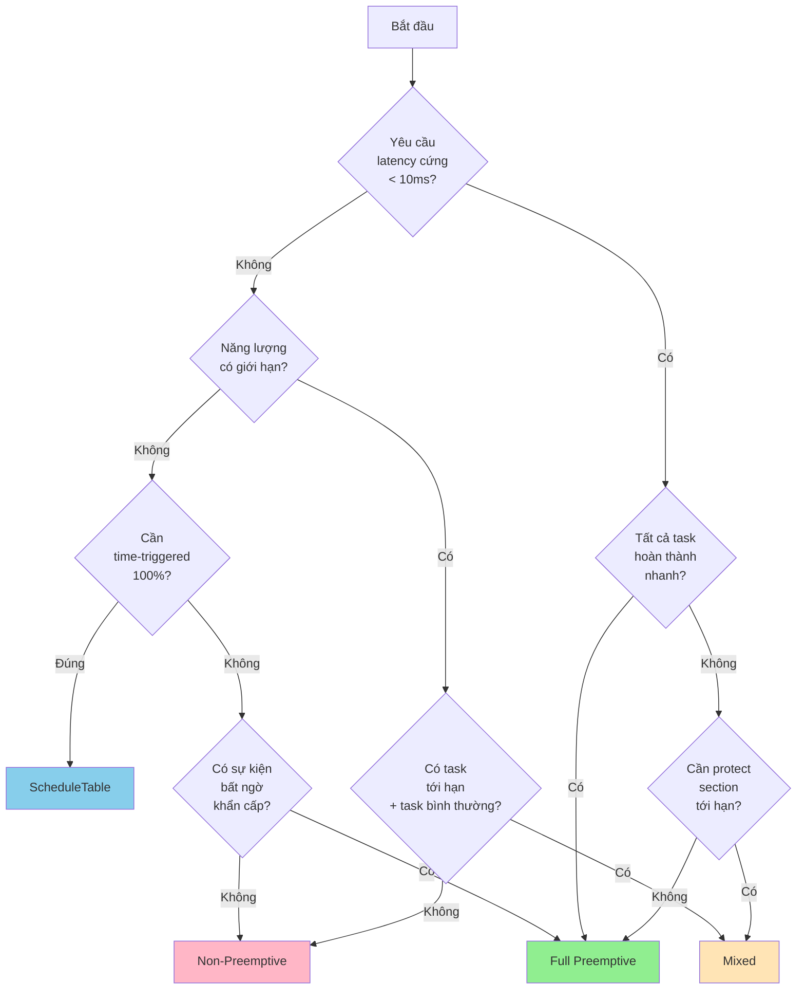

### Bộ Câu Hỏi Quyết Định

**1. Latency yêu cầu?**
- < 5ms → Full Preemptive / ScheduleTable
- 5-50ms → Preemptive / Mixed
- > 50ms → Non-Preemptive OK

**2. Số lượng task?**
- 1-3 task → Non-Preemptive / Priority FIFO
- 4-10 task → Preemptive / Mixed
- > 10 task → Full Preemptive / ScheduleTable

**3. Loại sự kiện?**
- Periodic chính xác → ScheduleTable
- Event-driven → Preemptive / Mixed
- Hybrid → Mixed + ScheduleTable

**4. Resource (CPU, Memory, Power)?**
- Giới hạn nghiêm → Non-Preemptive / ScheduleTable
- Không giới hạn → Full Preemptive

**5. Yêu cầu timing?**
- Hard real-time → Full Preemptive / ScheduleTable / Mixed
- Soft real-time → Bất kỳ
- No real-time → Non-Preemptive / Priority FIFO

---

## Tài Liệu Tham Khảo

### Từ Source Code Project

| File                                                                                                                       | Liên quan                                     |
| -------------------------------------------------------------------------------------------------------------------------- | --------------------------------------------- |
| [autosar/services/system/os/kernel/src/Os_Kernel.c](../../autosar/services/system/os/kernel/src/Os_Kernel.c)               | Main scheduler loop, preemption logic         |
| [autosar/services/system/os/kernel/src/Os_Internal.c](../../autosar/services/system/os/kernel/src/Os_Internal.c)           | Ready queue implementation                    |
| [autosar/services/system/os/kernel/src/Os_Task.c](../../autosar/services/system/os/kernel/src/Os_Task.c)                   | Task activation, termination, scheduling      |
| [autosar/services/system/os/kernel/src/Os_ScheduleTable.c](../../autosar/services/system/os/kernel/src/Os_ScheduleTable.c) | Time-triggered scheduling                     |
| [config/os/Os_Cfg.c](../../config/os/Os_Cfg.c)                                                                             | Task configuration (priority, preemptibility) |

### Examples Liên Quan

| Example                                                                      | Thuật toán                   |
| ---------------------------------------------------------------------------- | ---------------------------- |
| [examples/01_Basic_Tasks_Heartbeat](../../examples/01_Basic_Tasks_Heartbeat) | Priority-Based FIFO          |
| [examples/11_Preemption_Scenario](../../examples/11_Preemption_Scenario)     | Full Preemptive              |
| [examples/06_Schedule_Table](../../examples/06_Schedule_Table)               | Time-Triggered ScheduleTable |
| [examples/04_Resource_Shared_Data](../../examples/04_Resource_Shared_Data)   | Mixed (resource protection)  |

### Bài Học Liên Quan Trong Khóa

| Bài                                           | Ngestand                  |
| --------------------------------------------- | ------------------------- |
| 08_Ready_Queue_Priority_Dispatch.md           | Cơ bản queue priority     |
| 09_Preemption_Edge_Cases_Fairness.md          | Preemption chi tiết       |
| 20_ScheduleTable_Hook_Error_ISR_Regression.md | Time-triggered scheduling |
| 07_TCB_Stack_Init_Task_States.md              | Task states & transitions |
| 12_TerminateTask_Schedule_Multi_Activation.md | Schedule points           |

---

## FAQ - Các Câu Hỏi Thường Gặp

**Q: Tại sao task thấp priority có thể block task cao priority?**  
A: Trong Non-Preemptive, nếu task thấp priority không tự kết thúc hay block, task cao phải chờ. Giải pháp: dùng Preemptive hoặc set task thấp là non-preemptible nhưng làm nó nhanh.

**Q: Context switch overhead bao nhiêu?**  
A: Khoảng 50-200 CPU cycles per context switch (phụ thuộc arch). Với Cortex-M4 @ 168MHz, ~0.3-1.2 µs per switch.

**Q: Priority inversion là gì?**  
A: Khi task cao priority đợi lock được nắm giữ bởi task thấp priority. Giải pháp: Priority Ceiling Protocol (PCP) hoặc Immediate Ceiling Priority.

**Q: ScheduleTable có thể miss action không?**  
A: Có, nếu ISR lâu khiến tick bị delay. Kiểm tra trong error hook của action.

**Q: Nên dùng bao nhiêu priority level?**  
A: OSEK khuyến cáo 3-5 level. > 10 level sẽ config khó khăn.

---

**Tài liệu này được tạo để hỗ trợ hiểu biết sâu về các thuật toán lập lịch trong OSEK-RTOS. Vui lòng kết hợp với source code thực tế để thực hành.**
